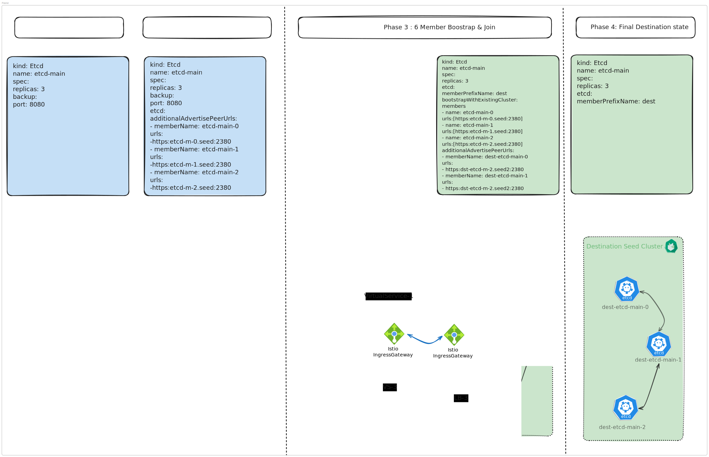
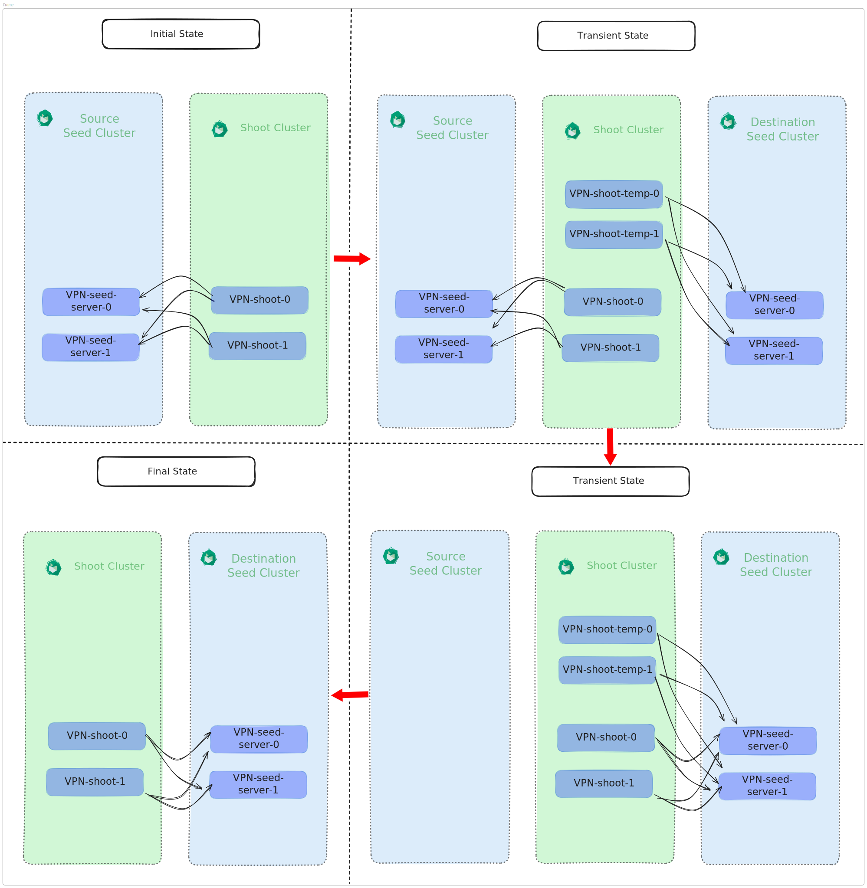

# GEP-0039: Live Control Plane Migration

## Table of Contents

- [GEP-0039: Live Control Plane Migration](#gep-0039-live-control-plane-migration)
  - [Table of Contents](#table-of-contents)
  - [Table of Contents](#table-of-contents-1)
  - [Terminology](#terminology)
  - [Summary](#summary)
  - [Motivation](#motivation)
  - [Goals](#goals)
  - [Non-Goals](#non-goals)
  - [Proposal](#proposal)
    - [Approach](#approach)
    - [Prerequisites](#prerequisites)
    - [Gardener](#gardener)
      - [Shoot API](#shoot-api)
      - [Lease Management](#lease-management)
      - [etcd Peer Communication](#etcd-peer-communication)
      - [Components with Shoot webhooks/Controller and Shoot-managed resources](#components-with-shoot-webhookscontroller-and-shoot-managed-resources)
      - [Live Migration Flow](#live-migration-flow)
    - [etcd-druid](#etcd-druid)
      - [Six member etcd cluster](#six-member-etcd-cluster)
      - [Member removal from the cluster](#member-removal-from-the-cluster)
      - [Decoupling Member Names from Pod Names](#decoupling-member-names-from-pod-names)
    - [VPN](#vpn)
    - [Failures and Recovery Strategy](#failures-and-recovery-strategy)
      - [**ETCD Quorum loss**](#etcd-quorum-loss)
        - [The destination members are unable to join](#the-destination-members-are-unable-to-join)
        - [Quorum is lost at any other stage](#quorum-is-lost-at-any-other-stage)
      - [Kube API Server is unhealthy](#kube-api-server-is-unhealthy)
        - [ETCD is unhealthy](#etcd-is-unhealthy)
        - [ETCD is healthy](#etcd-is-healthy)
    - [Future Scope](#future-scope)
  - [Alternatives](#alternatives)
    - [etcd Mirror Maker](#etcd-mirror-maker)
    - [etcd Gateway](#etcd-gateway)
    - [3-Member etcd Cluster](#3-member-etcd-cluster)

## Terminology

**Source Seed** is the seed which currently hosts the control plane of the Shoot cluster.

**Destination Seed** is the seed to which the control plane of the Shoot cluster is being migrated.

**Distant Regions** are regions separated geographicaly with round-trip distance more than the configured threshold.

## Summary

This proposal introduces Live Control Plane Migration (Live CPM) in Gardener, enabling migration of a Shoot cluster’s control plane without API server downtime.

Live CPM adds support for phased control plane migration, allowing critical components to be brought up in the destination seed while the source control plane remains active. It introduces mechanisms to maintain etcd data consistency during migration and to preserve connectivity for webhooks throughout the process.

-----

## Motivation

The existing CPM process is mature but results in a downtime window typically lasting 10-20 minutes. This violates the high-availability requirements for certain mission-critical applications running in Shoot clusters.

Introducing Live CPM would:

1. Allow migration of a Shoot's control plane with zero downtime.
2. Enable cleanup of legacy seeds.
3. Become the foundation for seed autoscaling.

-----

## Goals

1. Achieve **zero-downtime** for the Shoot cluster's Kubernetes API server during the migration process.
1. Maintain **etcd data consistency** between the Source and Destination Seed control planes throughout the migration phase by making use of a 6-member etcd cluster.
1. Maintain fully functional VPN tunnel throughout the migration for the webhooks or logs/exec to remain operational.

## Non-Goals

1. Allow Live CPM for non-HA shoots.
1. Allow changing the Shoot spec during migration.
1. Supporting Live CPM between seeds running on different cloud providers.
1. Allowing Live CPM between distant regions.
1. Replacing the current CPM solution.
1. Retaining the old logs and metrics from the source seed.

-----

## Proposal

### Approach

Live CPM is orchestrated by `gardenlet` through a step-based, coordinated process, where the source and destination `gardenlet`s work in conjunction, each responsible for specific stages of the migration. Progress is tracked explicitly in the `Shoot` status to ensure deterministic coordination.

It aims to achieve migration by:

1. Setting up the core control plane components (API server, etcd) on the destination Seed while the control plane components in the source Seed are still active.
2. Using a temporary 6-member etcd cluster (3 members in source Seed + 3 members in destination Seed) to ensure data consistency.
3. Using a temporary VPN to keep the Shoot webhooks active throughout the migration process.

The goal is to provide a user experience where the Shoot control plane remains fully operational with no observable downtime for API server traffic.

By default, **[Control Plane Migration (CPM)](https://github.com/gardener/gardener/blob/master/docs/operations/control_plane_migration.md)** is triggered when a Shoot’s `.spec.seedName` is changed to a Seed that differs from `.status.seedName`.

To trigger **Live CPM**, a new operation annotation, `gardener.cloud/operation=live-migrate`, will be introduced. If a Shoot has this annotation set at the time the migration is triggered, Live CPM will be performed instead of the normal CPM.

> [!NOTE]
> Setting the annotation `gardener.cloud/operation=live-migrate` will be **forbidden** for hibernated Shoots, as live migration provides no benefit in this case. If a hibernated Shoot needs to be migrated, the normal CPM should be used instead.

### Prerequisites

- The source and destination seed clusters must not be in Distant Regions. Gardener can use the `garden-scheduler` [ConfigMap](https://github.com/gardener/gardener/blob/v1.134.1/docs/concepts/scheduler.md#minimal-distance-strategy) to evaluate the inter-seed "distance" (for example, network latency).
  - Operators can define a landscape-specific threshold by annotating this ConfigMap with `migration.gardener.cloud/inter-seed-distance-threshold=<value>` (for example, `180` when the distance metric is network latency in milliseconds). The value of `180` was derived from extensive testing across different cloud providers. If operators use a different distance metric, they must adjust the threshold accordingly.
  - If the scheduler ConfigMap or the threshold annotation is not provided, Gardener cannot determine the distance between seeds. In such cases, operators may still force a migration by annotating the Shoot with `migration.gardener.cloud/allow-distant-regions=true`, fully aware of the associated risks.
- Both the source and destination seed clusters must be healthy and run the same gardenlet version.

### Gardener

#### Shoot API

A new field `status.liveMigration` will be introduced in the Shoot status to track the status of the migration process.

```yaml
status:
  liveMigration:
    source:
      stepName: string # A unique identifier for the step (e.g., "SixMemberETCDReady", "ExtensionsRestored")
      status: Succeeded/Error/Failed
      message: string # Optional detail about the step completion
      completionTime: string
    destination:
      stepName: string # A unique identifier for the step (e.g., "SixMemberETCDReady", "ExtensionsRestored")
      status: Succeeded/Error/Failed
      message: string # Optional detail about the step completion
      completionTime: string
```

#### Lease Management

Leases are used to coordinate ownership and leadership. Components that manage resources in the Shoot cluster and are deployed in the Seed cluster should maintain their leases in the Shoot cluster. This ensures that only one control plane instance (source or destination) performs operations on the resources at any given time, preventing split-brain scenarios.

> [!NOTE]
> The [Machine Controller Manager (MCM)](https://github.com/gardener/machine-controller-manager) holds its lease in the Seed cluster. This is not an issue because, once the migration starts, the source MCM stops acting, and the destination MCM is expected to take over only after all machines have been migrated to the destination Seed.

#### etcd Peer Communication

Each etcd member pod is individually exposed to enable direct and controlled peer communication during migration required for the [six member etcd cluster](#six-member-etcd-cluster), allowing it to communicate with its peers across both the source and destination Seed clusters. This exposure is achieved via Istio, leveraging the `IngressGateway` LoadBalancer in both the source and destination seeds.

For both source and destination seeds, the following resources are created:

- A single `Gateway` resource.
- Three `VirtualService` resources (one per etcd member) to perform host-based routing to the respective etcd member `Service`.
- Three `DNSRecord` resources (one per etcd member), each pointing to the respective Seed Istio `IngressGateway` LoadBalancer. Traffic is routed to the correct etcd member via Istio host-based routing defined in the corresponding `VirtualService`.

#### Components with Shoot webhooks and Controllers reconciling shoot objects

For components with webhooks or controllers running in the Seed (e.g., Lakom extension), a brief unavailability is acceptable during the handover to the destination control plane. Webhook requests may fail, and controllers may not reconcile Shoot resources until the destination components are ready. For the initial implementation of Live CPM, this short unavailability is considered an acceptable trade-off. Future iterations may aim to eliminate this downtime entirely.

#### Live Migration Flow


### etcd-druid

#### Six member etcd cluster

- To achieve zero downtime and ensure data consistency in etcd throughout the migration process, the etcd cluster will first expand from a three-member cluster to a six-member cluster by adding three members residing in the destination seed cluster. Once the migration is complete, the etcd cluster will shrink back from six members to three members by removing the three members residing in the source seed cluster.
- To achieve a six-member etcd cluster, etcd-druid will introduce the following functionality:
    - **Multiple peer addresses**: Each member can have multiple peer addresses, and these peer addresses can be exposed through a load balancer to allow communication between members spanning over different Kubernetes clusters.
    - **Bootstrap with existing cluster**: A new functionality will be introduced so that when a new etcd CR is created, its members can join an existing etcd cluster created by a different etcd CR.
    - **Skipping Peer Certificate SAN Validation**:
`-experimental-peer-skip-client-san-verification` flag allows etcd peer connections to skip client certificate SAN (Subject Alternative Name) verification during TLS handshakes.
During Live CPM, etcd peer communication spans multiple Kubernetes clusters and is routed through load balancers. etcd performs reverse lookup–based identity verification for peer connections, which would require the load balancer IPs to be present in the peer certificate SANs or resolvable within the etcd pod. However, these load balancer IPs cannot be configured deterministically, as traffic is source-NATed to node IPs before reaching the etcd pods. As a result, reverse lookup cannot reliably resolve the original peer endpoint, causing certificate verification to fail.
Skipping SAN verification allows peer communication to succeed during the temporary six-member cluster phase while still preserving TLS encryption.



#### Member removal from the cluster
- During the six-member cluster formation, the destination seed cluster's etcd CR contains fields to bootstrap from the source cluster. To complete the migration, the etcd member count needs to be brought back to three by removing the members that are part of the source seed cluster. For this, the bootstrap with source cluster field is removed from the destination cluster's etcd CR. We will leverage the GEP-28 (Self-Hosted Shoot Clusters) mechanism for removing etcd members by invoking HTTP endpoints on the backup-restore sidecar.

#### Decoupling Member Names from Pod Names
- Currently, member names are same as the pod names of the etcd members. In a six-member cluster where members are spread across two Kubernetes clusters, pod names can be the same since they are derived from the etcd CR. This leads to issues where new members cannot join due to conflicting member names.
- To prevent this, etcd member names should be decoupled from the etcd pod names. At the time of writing the GEP, it is not yet clear how this will be implemented, but the related [issue](https://github.com/gardener/etcd-backup-restore/issues/896) can be followed for updates.


- **ETCD Druid API**

  - **`additionalAdvertisePeerUrls`**

    ```yaml
    apiVersion: druid.gardener.cloud/v1alpha1
    kind: Etcd
    metadata:
      name: etcd-target
    spec:
      etcd:
        # ... existing config ...
        additionalAdvertisePeerUrls:
        - memberName: etcd-target-0
          urls:
          - "http://target-lb-0.elb.amazonaws.com:2380"
        - memberName: etcd-target-1
          urls:
          - "http://target-lb-1.elb.amazonaws.com:2380"
        - memberName: etcd-target-2
          urls:
          - "http://target-lb-2.elb.amazonaws.com:2380"
    ```

  - **`bootstrapWithExistingCluster`**

  - API changes to allow passing additional etcd flags via the ETCD Druid custom resource.

  - Member name prefixes to enable decoupling of etcd members from their underlying infrastructure.


### VPN
In Gardener, VPN connectivity is required for logging, webhooks, and other services in the shoot cluster to function correctly. These components must remain operational throughout the migration.

To achieve this, a temporary VPN tunnel is established from the shoot cluster to the destination seed using a temporary VPN shoot client with a dedicated DNS record. Once the VPN tunnel from the shoot cluster to the destination seed is established using the original VPN shoot client, the temporary VPN client is removed.



### Failures and Recovery Strategy

#### **ETCD Quorum loss**

##### The destination members are unable to join

If the six member cluster is unable to get formed because the members in the destination seed fails to join the cluster, it indicates a fundamental environment issue, likely that the user forced a migration across regions where latency exceeds the supported limits. In this scenario, the safest course of action is to abort the migration and revert to the normal CPM.

To trigger an abort, the annotation `migration.shoot.gardener.cloud/abort-live-migration=true` should be added to the Shoot. This is permitted only while the `liveMigration` status with step `SixMemberETCDReady` is in `Failed` state. Once annotated, you can switch the seed name back to the source seed in the Shoot spec; the gardenlet will then orchestrate the cleanup of migration-specific resources across both the source and destination seeds. The destination gardenlet will also take care to remove the newly added members from the etcd cluster.


##### Quorum is lost at any other stage

It is also possible that quorum is lost at a later stage due to unexpected failures. In such cases, the quorum should first be restored manually by the human operator in the source cluster using backups. Once the source is healthy and some required steps are performed with the destination etcd CR, the migration can resume to re-form the six-member cluster and continue the migration process.

#### Kube API Server is unhealthy

##### ETCD is unhealthy

If the Kube API Server (KAPI) is down because the underlying etcd has lost quorum, follow the recovery steps outlined under ETCD Quorum Loss.

##### ETCD is healthy

If ETCD is healthy but the Kube API Server is unable to come up in the destination, it is likely due to the six-member etcd cluster being span across high latency regions and Kube API Server using linearized reads. In this situation, some downtime is unavoidable, and we must prioritize recovering the Kube API Server in the destination cluster.

By applying the annotation `migration.gardener.cloud/force-shrink-etcd=true`, you signal the destination gardenlet to preemptively remove the three source members before deploying the destination Kube API Server as part of the flow. With all etcd members now running in the destination seed, the Kube API Server should be able to start successfully. Consequently, the member removal step at the end of the standard flow will be treated as a no-op.

On the source side, the presence of this annotation instructs the gardenlet to skip readiness checks for ETCD and KAPI, as these components will naturally fail once their members are removed. The system will immediately update DNS records to point to the destination KAPI. As a result, a brief period of downtime is expected.

> [!NOTE]
> A comprehensive step-by-step guide will be provided to help recover from various issues. Other failures not explicitly documented above should not be specific to live CPM and can be handled through standard recovery procedures, with or without manual intervention.

### Future Scope
- Implement LiveCPM for non-HA shoots.
- Automated LiveCPM for seed management.
- Multihop LiveCPM for migration to distant regions.

## Alternatives
### etcd Mirror Maker 
[etcd Mirror Maker](https://github.com/etcd-io/etcd/blob/main/etcdctl/doc/mirror_maker.md) is an etcd feature that continuously replicates key-value data from a source etcd cluster to a destination etcd cluster using an initial sync followed by asynchronous update propagation. However, it has the following limitations:
  - **Revision loss**: etcd Mirror Maker does not preserve revision history during initial sync, which violates Kubernetes watch and consistency guarantees.
  - **Unsafe cutover**: Mirror Maker provides no atomic cutover mechanism, allowing stale writes during endpoint switching.
  - **Asynchronous replication**: The asynchronous replication model cannot guarantee that the destination etcd is fully caught up at any point in time.
  - **Latency sensitivity**: Replication throughput degrades significantly with increased network latency, making it unreliable even across nearby regions.
  - **Downtime requirement**: Preventing data inconsistency would require stopping writes to the source etcd, which contradicts the zero-downtime goal of Live CPM.

### etcd Gateway
ETCD Gateway is an approach where etcd instances in the destination seed initially act as proxies that route traffic to their corresponding etcd members in the source seed cluster.
  - Three etcd pods are started in the destination seed cluster in proxy mode, forwarding all requests to their respective source etcd members.
  - Each destination etcd pod is then converted into an actual etcd member one by one, while the corresponding source etcd member is switched to proxy mode.
  - Once all members are migrated, the source etcd cluster is shut down.

  However, this approach has the following limitations:
  - **Reduced fault tolerance**: During each transition step, one etcd member is temporarily unavailable, reducing quorum resilience.
  - **Operational complexity**: The proxy-to-member and member-to-proxy transitions require precise coordination and are difficult to automate safely.

### 3-Member etcd Cluster
  This approach migrates etcd by moving members one by one from the source seed to the destination seed, while keeping the etcd cluster size at three throughout the process.

  However, this approach has the following limitations:
  - **Temporary loss of quorum safety**: During each member migration, the cluster operates with reduced fault tolerance, as only two members remain fully available.
  - **No strong availability guarantees**: While the cluster may remain functional under ideal conditions, it cannot guarantee continuous availability under real-world load or failure scenarios.
