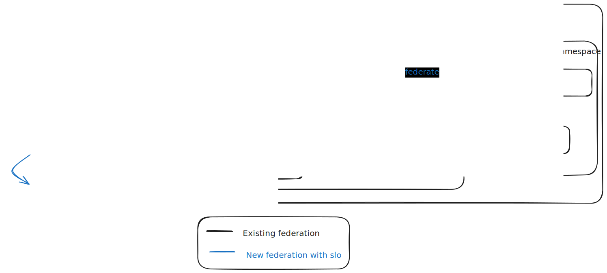

# GEP-0041: SLO Monitoring

## Table of Contents

- [GEP-0041: SLO Monitoring](#gep-0041-slo-monitoring)
  - [Table of Contents](#table-of-contents)
  - [Summary](#summary)
  - [Motivation](#motivation)
    - [Goals](#goals)
    - [Non-Goals](#non-goals)
  - [Proposal](#proposal)
    - [High level Architecture](#high-level-architecture)
    - [Scalability](#scalability)
    - [Constraints/Caveats](#constraintscaveats)
      - [Seed inaccessibility](#seed-inaccessibility)
    - [Risks and Mitigations](#risks-and-mitigations)
  - [Design Details](#design-details)
    - [Initial SLOs](#initial-slos)
      - [kube-apiserver general availability](#kube-apiserver-general-availability)
      - [kube-apiserver latency](#kube-apiserver-latency)
      - [kube-apiserver Error rate](#kube-apiserver-error-rate)
      - [Machine creation latency](#machine-creation-latency)
      - [Node general availability](#node-general-availability)
      - [Shoot general availability](#shoot-general-availability)
      - [Shoot creation latency](#shoot-creation-latency)
      - [Shoot reconcile latency](#shoot-reconcile-latency)
  - [Drawbacks](#drawbacks)
  - [Alternatives](#alternatives)
  - [References](#references)

## Summary

<!--
This section is incredibly important for producing high-quality, user-focused
documentation such as release notes or a development roadmap. It should be
possible to collect this information before implementation begins, in order to
avoid requiring implementors to split their attention between writing release
notes and implementing the feature itself. GEP editors should help to ensure
that the tone and content of the `Summary` section is useful for a wide audience.

A good summary is probably at least a paragraph in length.
-->
Although Gardener and Kubernetes expose a lot of metrics, there is presently no easy way to evaluate the availability of a shoot from the customer (shoot owner/operator) perspective. In the context that Gardener is meant to run a multitude of Kubernetes clusters at scale, operating it is usually not an easy endeavor. Having such means to measure and monitor the shoot's reliability is a key aspect from both customer happiness and operational excellence.

## Motivation

<!--
This section is for explicitly listing the motivation, goals, and non-goals of
this GEP. Describe why the change is important and the benefits to users.
-->

Day-2 operation tooling is a must to help drive adoption. This also mimics industry best practices as described in the [SRE book](https://sre.google/sre-book/table-of-contents/).

This extension also enables Gardener operators and developers to make data-driven decisions about reliability vs feature prioritization while providing clear visibility into system health.

This would benefit multiple user personas, including:

- Operator: Having a ready to go extension to help with reliability and day-to-day operations
- Developers: Having SLOs is a great tool to help prioritize between reliability and feature issues.
- Users: Since SLOs are internal objectives meant for Gardener operators, they are normally not shared with the end users (shoot owners/operators). However, better reliability generally makes customers happy, which in turn drives user adoption.

### Goals

<!--
List the specific goals of the GEP. What is it trying to achieve? How will we
know that this has succeeded?
-->
- An SLO (service level objective) extension that provides a standardized framework for measuring and monitoring shoot cluster reliability, always from the customer perspective. By customer perspective, we want to focus on metrics that would reflect the customer's experience and satisfaction in operating their shoot clusters.

### Non-Goals

<!--
What is out of scope for this GEP? Listing non-goals helps to focus discussion
and make progress.
-->
- Provide SLAs to customers. SLOs are internal objectives for Gardener operators, and are not meant to be shared with customers (shoot owners/operators). However, such extension could be used to provide SLAs in the future, if desired.

## Proposal

<!--
This is where we get down to the specifics of what the proposal actually is.
This should have enough detail that reviewers can understand exactly what
you're proposing, but should not include things like API designs or
implementation. What is the desired outcome and how do we measure success?.
The "Design Details" section below is for the real
nitty-gritty.
-->

### High level Architecture

This extension delivers 4 core capabilities:

- **Default and custom SLI**: A set of predefined SLIs/SLOs based on industry best practices for Kubernetes clusters and Gardener specifics, but always from the customer perspective. However, since the needs of each Gardener operator may vary, these defaults will be configurable. There should also be the ability to define custom SLIs based on specific metrics exposed by Gardener or the shoot clusters. However, those SLIs would need to be generic across the landscape.
- **Configurable SLOs**: The SLO parameters (SLI, threshold, ...) should be configurable. Then a templating engine would generate the necessary Prometheus recording rules and Perses dashboards.
- **SLO-based alerting**: Since we have the data to calculate SLO violations and burn rates (SRE best practice), we should also provide, as part of the extension, the capability to configure an Alertmanager based on those SLOs. Again, this should be configurable to fit the needs of each Gardener operator.
- **Monitoring infrastructure**: The extension should provide the necessary monitoring infrastructure to collect, store, and visualize SLO-related metrics. This includes Prometheus rules for SLI calculation, Perses dashboards for visualization, Prometheus alerts for SLO violations, Alertmanager to manage those alerts, etc.

The extension builds on the existing monitoring infrastructure (Prometheus operator, Perses operators, plutono annotations, ...), using a dedicated Prometheus instance in the runtime cluster to collect and aggregate SLO-specific metrics with minimal impact on the existing monitoring systems.



### Scalability

The metrics used to calculate SLOs are getting scrapped by 2 Prometheus instances: the `prometheus-garden` in the runtime cluster and a dedicated `prometheus-shoot` in each shoot cluster. In order to be able to scale across a landscape with a large number of shoots, we need to make sure that the `prometheus-slo` doesn't do too much processing.

Hence, in order to be able to scale horizontally, the SLI processing related to metrics in the shoot clusters will be done in the `prometheus-shoot`. Then the `prometheus-slo` in the runtime cluster is only responsible for aggregating those precomputed SLIs at the shoot level (through the `prometheus-aggregate` in the seed) and calculating the overall SLOs.

For metrics coming from the `prometheus-garden`, since they are not expected to be as numerous as the ones coming from the shoots, we can afford to do the SLI processing directly in the `prometheus-slo`, in order to have the smallest possible impact on the existing monitoring systems.

### Constraints/Caveats

<!--
What are the caveats to the proposal?
What are some important details that didn't come across above?
Go in to as much detail as necessary here.
This might be a good place to talk about core concepts and how they relate.
-->

#### Seed inaccessibility

In some cases, the seed cannot be reached from the runtime cluster, so Prometheus is not able to scrape (federate) metrics from the seed. This is the case when a seed is in a network segment (behind a firewall) that forbids incoming traffic from the runtime cluster. In those cases, gardenlet still works because its connection is initiated from the seed to the runtime/garden cluster (NAT or similar egress policy has to be allowed). Hence, since Prometheus is not able to scrape metrics from the seed, we would not be able to calculate SLOs based on those metrics.

To enable total coverage across a landscape, there are 2 possible solutions:

- **Push-based metrics**: In this approach, instead of relying on Prometheus `federate` (pull) mechanism, we could implement a flag in the seed's configuration to use Prometheus `RemoteWrite` capability to push metrics to the `prometheus-garden`/`prometheus-slo` in the runtime cluster. This would require changes in the gardenlet to configure prometheus properly. This also requires the prometheus operator to support `RemoteWrite` (work still ongoing in https://github.com/prometheus-operator/prometheus-operator/issues/6508). See [related issue in monotoring repo](https://github.com/gardener/monitoring/issues/59).

- **Reverse VPN**: Another approach could be to establish a reverse VPN connection from the seed to the runtime cluster, allowing Prometheus to scrape metrics as if it were directly accessible. This would require setting up reversed VPN tunnels for each seed, similar to what we already do between seed<=>shoot clusters. Although this approach could also enable other use cases, it also adds complexity and operational overhead, so it should be carefully evaluated before being implemented.

### Risks and Mitigations

<!--
What are the risks of this proposal, and how do we mitigate? Think broadly.
For example, consider both security and how this will impact the larger
Gardener ecosystem.
-->
Since we are precomputing SLIs in the shoot clusters, there is a risk that the additional processing could have an impact on the performance of the `prometheus-shoot`. To mitigate this risk, we will define the SLI as prometheus rules, which would compute each metric shortly after the scrape. This way, we spread the computational overhead over time and avoid having a big spike of CPU usage at the moment of the scrape. We will also make sure to optimize the Prometheus rules as much as possible to minimize the impact on the performance.

## Design Details

<!--
This section should contain enough information that the specifics of your
change are understandable. This may include API specs (though not always
required) or even code snippets. If there's any ambiguity about HOW your
proposal will be implemented, this is the place to discuss them.
-->
### Initial SLOs

The following SLOs are proposed as initial defaults, based on industry best practices for Kubernetes clusters and Gardener specifics, but always from the customer perspective. These are meant to be configurable, so they can be adapted to the needs of each Gardener operator. They are also meant to be adjusted on a regular basis based on real world data and experience, especially the thresholds. The goal is to have realistic and achievable SLOs that reflect the customer's experience and satisfaction in operating their shoot clusters.

We decided to focus on 3 main topics for the initial SLOs:

- Kube-apiserver is available, quick (latency) and without error.
- Machines (nodes) are able to get created in a timely manner (join the cluster) and are running normally
- Shoots are healthy, are able to get created and can reconcile in a timely manner

> [!NOTE]
> We are using a time windows of 28 days by default here, but this is going to be configurable based on the needs of each Gardener operator.

> [!NOTE]
> We are not aiming for perfection for the initial implementation, but rather to have a good starting point that can be improved over time based on real world data and experience. The goal is rather to have realistic and achievable SLOs that reflect the customer's experience and satisfaction in operating their shoot clusters. Hence, after the initial implementation, we should regularly review, adjust and add SLOs based on the data we collect and the feedback we get from customers and operators.

### kube-apiserver general availability

- SLI specification: The proportion of requests received with successful response from multiple sources vs the total amount of requests. In order to prevent false positive, a successful request is defined as at least 1 successful requests from any of the sources (inversely, a failing request means that it's failing from all sources are the same time). This is metric is processed at the shoot level.
- SLI implementation:

  ```promql
  avg_over_time(
    max(
      probe_success{instance="https://api.internal_domain/healthz", type="seed"}
      OR
      probe_success{instance="https://kubernetes.default.svc.cluster.local/healthz", type="shoot"}
      OR 
      on() vector(0)
    )[4w:5m]
  ) * 100
  ```
  
- SLO Threshold: default should be 99.95%, but this would be configurable
- Notes:
  - In addition to what's above, we should also add another probe from the shoot to the external endpoint of the kube-apiserver. This way, it should effectively filter out problems from the internet / external to us and focus on problems between the seed's load balancer and the kube-apiserver.

### kube-apiserver latency

- SLI specification: Ratio of requests to the kube-apiserver that take less than 1s to complete (`WATCH`, `LIST`, `CONNECT` and other type of requests like WebSocket are excluded, aka including only "regular" HTTP requests) vs the total amount of requests. This is metric is processed at the shoot level.
- SLI implementation:

  ```promql
  (1- shoot:apiserver_latency:percentage) * 100
  ```

- SLO Threshold: default TBD based on real world data, but this would be configurable
- Notes:
  - The `shoot:apiserver_latency:percentage` is a metric created from a Prometheus rule, defined [here](https://github.com/gardener/gardener/blob/71650f56a7bfa555bfc5a09a1b1f97439a4b3d40/pkg/component/kubernetes/apiserver/prometheusrule.go#L181-L184).

### kube-apiserver Error rate

- SLI specification: The proportion of requests ending a successful response vs total amount of requests. This is metric is processed at the shoot level.
- SLI implementation:

  ```promql
  (1-(sum(rate(apiserver_request_terminations_total[1h])) or on() vector(0) / sum(rate(apiserver_request_total[1h])))) * 100
  ```

- SLO Threshold: default TBD based on real world data, but this would be configurable
Notes:
  - N/A

### Machine creation latency

- SLI specification: The amount of machine trasitionning from `Pending` to `Running` within 20 minutes vs the total amount of nodes `Pending`in the last 20 minutes. If no nodes were pending in the last 20 minutes, the SLO default oto 100%. This is metric is processed at the shoot level.
- SLI implementation:

  ```promql
  (
    count(
      (
        min_over_time(
          max by (name, namespace) (mcm_machine_current_status_phase)[20m:]
        ) == 0 // pending
      )
      and on (name, namespace)
      (
        max by (name, namespace) (mcm_machine_current_status_phase) == 1
      )
    )
  )
  /
  clamp_min(
    count(
      min_over_time(
        max by (name, namespace) (mcm_machine_current_status_phase)[20m:]
      ) == 0 // pending
    ),
    1
  ) or on() vector(1)
  ```

- SLO Threshold: default TBD based on real world data, but this would be configurable
- Notes:
  - We need to implement a histogram metric that doesn't exist at the moment: `mcm_machine_creation_duration_minutes_bucket`
  - confirm with MCM experts that the `Pending` state only happens during machine creation.

### Node general availability

- SLI specification: The amount of nodes that are ready vs the total amount of nodes, excluding nodes than are less than 10 minutes old (aka actively joining the cluster) and terminating nodes. This is metric is processed at the shoot level.

- SLI implementation:

  ```promql
  count(
    mcm_machine_current_status_phase == 1
    * on(name, namespace) group_left(node_name)
    mcm_machine_info
    and on(node_name) (
      (time() - label_replace(kube_node_created, "node_name", "$1", "node", "(.+)")) > 600
    )
  )
  /
  count(
    mcm_machine_current_status_phase
    * on(name, namespace) group_left(node_name)
    mcm_machine_info
    and on(node_name) (
      (time() - label_replace(kube_node_created, "node_name", "$1", "node", "(.+)")) > 600
    )
  )
  ```

  - `* on(name, namespace) group_left(node_name) mcm_machine_info `- Joins machine status with machine info to get the node_name label
  - `label_replace(kube_node_created, "node_name", "$1", "node", "(.+)")` - Renames node label to node_name for matching

- SLO Threshold: default TBD based on real world data, but this would be configurable
- Notes:
  - For now, we won’t take nodes less than 10 minutes old into account (default wait time for nodes to become ready is 20 minutes).
  - An easier way to approach this could be to simply exclude nodes that are in `Pending` state, however, we want to make sure that we are not excluding nodes that are for some reason stuck in `Pending` state and never transition to `Running`, which would give us a false positive. Hence, we are using the node creation time as a more reliable way to exclude only nodes that are actively joining the cluster.

### Shoot general availability

- SLI specification: The amount of conditions (specifically `ControlPlaneHealthy`, `SystemComponentsHealthy`, `APIServerAvailable` and `EveryNodeReady`) healthy and progressing vs the total amount of the same conditions. We are explicitly excluding `ObservabilityComponentsHealthy` since it's less important for the customers. This is calculation is done at the shoot level.
- SLI implementation:

  ```promql
  avg_over_time(
    (
      count(
        garden_shoot_condition{
          condition=~"ControlPlaneHealthy|SystemComponentsHealthy|APIServerAvailable|EveryNodeReady"
        } >= 1
      )
      /
      count(
        garden_shoot_condition{
          condition=~"ControlPlaneHealthy|SystemComponentsHealthy|APIServerAvailable|EveryNodeReady"
        }
      )
    )[4w:]
  ) * 100
  ```

  - `ControlPlaneHealthy|SystemComponentsHealthy|APIServerAvailable|EveryNodeReady` possible values are : -1 (unknown), 0 (fail), 1 (success), 2 (progressing).

- SLO Threshold: default TBD based on real world data, but this would be configurable
- Notes:
  - Sometimes, the shoots can get stuck in `progressing` state. However, there should already be a timeout in Gardener to set the shoot in `unhealthy` state after a certain amount of time, so we are not explicitly excluding `progressing` state here. We are rather considering that if a shoot is in `progressing` state for too long, it will eventually transition to `unhealthy` state and be counted as a failure.

### Shoot creation latency

- SLI specification: The amount of shoots getting fully created within 30 minutes vs the amount of shoots getting fully created.
- SLI implementation:

  ```promql
  sum(rate(garden_shoot_operation_duration_minutes_bucket{operation="Create", le="30"}[5m]))
  /
  sum(rate(garden_shoot_operation_duration_minutes_count{operation="Create"}[5m]))
  ```

- SLO Threshold: default TBD based on real world data, but this would be configurable
- Notes:
  - We need to implement a histogram metric that doesn't exist at the moment: `garden_shoot_operation_duration_minutes_bucket`. However, to our understanding, there is currently no way to know how long an operation took. It would probably be relatively simple to add a `duration` field to `.status.lastOperation`.

### Shoot reconcile latency

- SLI specification: The amount of shoots where the reconcile state is `Succeeded` within 30 minutes vs the amount of shoots where the reconcile state is `Succeeded`
- SLI implementation:

  ```promql
  sum(rate(garden_shoot_operation_duration_minutes_bucket{operation="Reconcile", le="30"}[5m]))
  /
  sum(rate(garden_shoot_operation_duration_minutes_count{operation="Reconcile"}[5m]))
  ```

- SLO Threshold: default TBD based on real world data, but this would be configurable
- Notes:
  - Same as for creation latency, we need to implement a histogram metric that doesn't exist at the moment: `garden_shoot_operation_duration_minutes_bucket`.

## Drawbacks

<!--
Why should this GEP _not_ be implemented?
-->
As per the [risks and mitigations section](#risks-and-mitigations) above, there is a risk that the additional processing in the shoot clusters could have an impact on the performance of the `prometheus-shoot`.

## Alternatives

<!--
What other approaches did you consider, and why did you rule them out? These do
not need to be as detailed as the proposal, but should include enough
information to express the idea and why it was not acceptable.
-->
- **Reusing existing Prometheus instances**: Due to a high computational overhead to calculate SLOs, we didn't think it is a good idea to reuse the existing `prometheus-garden`, since this could potentially have an impact in other metrics. Also, since we need to keep the metrics for a longer period to calculate SLOs (more than the time window choosed for the SLOs), reusing the existing instances with extended retention could lead to resource contention. Hence, isolating the SLO ensures stability and separation of concerns.
- **Implementing SLOs as part of Gardener core**: This functionnality also adds computational overhead for essentially all existing Prometheus instances, so we believe this should be opt-in for Gardener operators that want to use it.

## References

- [Kubernetes's SLI / SLO](https://github.com/kubernetes/community/blob/master/sig-scalability/slos/slos.md)
- [SRE Book](https://sre.google/sre-book/table-of-contents/) (why)
- [SRE Workbook](https://sre.google/workbook/table-of-contents/) (how)
