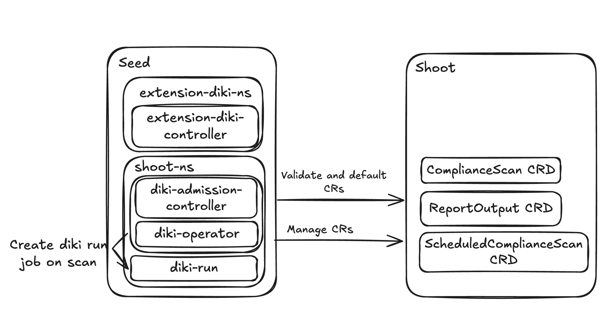
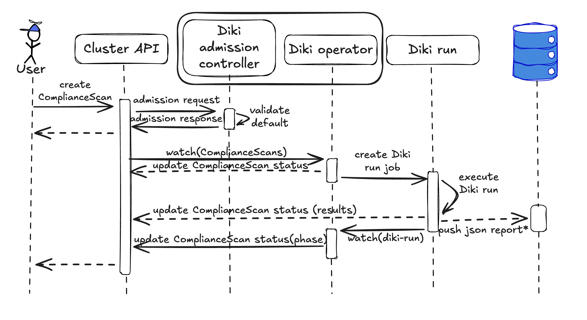

# GEP-63: Diki Extension

## Table of Contents

- [GEP-63: Diki Extension](#gep-63-diki-extension)
  - [Table of Contents](#table-of-contents)
  - [Summary](#summary)
  - [Motivation](#motivation)
    - [Goals](#goals)
    - [Non-Goals](#non-goals)
  - [Proposal](#proposal)
    - [Notes/Constraints/Caveats](#notesconstraintscaveats)
    - [Risks and Mitigations](#risks-and-mitigations)
  - [Design Details](#design-details)
    - [Extension Registration](#extension-registration)
    - [API](#api)
      - [ComplianceScan](#compliancescan)
      - [ReportOutput](#reportoutput)
      - [ScheduledComplianceScan](#scheduledcompliancescan)
    - [Components](#components)
      - [diki-extension-controller](#diki-extension-controller)
      - [diki-operator](#diki-operator)
      - [diki-admission-controller](#diki-admission-controller)
      - [diki-run](#diki-run)
    - [Architecture](#architecture)
    - [Lifecycle Management](#lifecycle-management)
  - [Future Enhancements](#future-enhancements)
  - [Drawbacks](#drawbacks)
  - [Alternatives](#alternatives)
    - [Central Compliance Service in a Dedicated Cluster](#central-compliance-service-in-a-dedicated-cluster)
    - [Trivy Operator for Compliance Scanning](#trivy-operator-for-compliance-scanning)

## Summary

[Diki](https://github.com/gardener/diki) is a compliance checker that evaluates
the security posture of Kubernetes clusters against pluggable rulesets such as
the [DISA Kubernetes STIG](https://public.cyber.mil/stigs/). Today, Gardener
users must install and operate the Diki CLI themselves — scheduling scans,
managing configuration, and collecting reports manually.

This GEP proposes a new Gardener extension, `gardener-extension-diki`, that deploys
the [diki-operator](https://github.com/gardener/diki-operator) into shoot
cluster control planes. The operator introduces three Custom Resource
Definitions — `ComplianceScan`, `ReportOutput`, and `ScheduledComplianceScan` —
that allow shoot users to run on-demand and scheduled compliance scans
declaratively, with summary results reported directly in resource status fields.
The extension follows the standard Gardener extension contract
(`ControllerRegistration`, `ManagedResource`-based deployment, admission
webhooks) and keeps the compliance workload inside the seed, avoiding
privileged components in the shoot data plane.

## Motivation

Compliance scanning is a critical operational concern for Gardener users,
particularly those operating in regulated environments that require periodic
proof of adherence to security baselines such as the DISA Kubernetes STIG.

Currently, Gardener recommends the Diki CLI for running compliance scans. This
places the full operational burden on each user:

- Manual scheduling: Users must set up their own cron jobs or CI pipelines
  to trigger scans on a recurring basis.
- Configuration management: Each user independently manages Diki
  configuration files, ruleset versions, and rule options.
- Report collection and storage: Scan results are local JSON files that
  users must collect, store, and distribute themselves.
- No cluster-native integration: There is no Kubernetes-native way to
  request a scan, inspect results, or configure recurring scans — everything
  happens outside the cluster API.

Providing compliance scanning as a first-class Gardener extension removes these
burdens and makes compliance accessible to all shoot users through familiar
Kubernetes resource semantics.

### Goals

-  Introduce `gardener-extension-diki` as a Gardener extension
   that deploys the `diki-operator` into shoot control planes on seeds.
-  Allow shoot users to run on-demand compliance scans by creating a
   `ComplianceScan` custom resource in their shoot cluster.
-  Allow shoot users to schedule recurring compliance scans via a
   `ScheduledComplianceScan` custom resource.
-  Provide scan result summaries in the `ComplianceScan` status, including
   per-ruleset pass/fail counts and references to detailed report outputs.
-  Support configurable report outputs via the `ReportOutput` custom resource.
-  Follow the standard Gardener extension contract (controller registration,
   `ManagedResource`-based deployment, admission webhooks).

### Non-Goals

-  Remediation of compliance findings. Diki is a detective tool, it reports
   non-compliance but does not modify cluster resources to fix findings.
-  Deploying or managing persistent storage backends for reports (e.g.,
   PostgreSQL, OpenSearch, ODG). The `diki-operator` will support exporting
   reports to such storage, but provisioning and operating the storage itself is
   out of scope.
-  Integration with the Gardener Dashboard.


## Proposal

Introduce `gardener-extension-diki` as a new extension in the
Gardener GitHub organization. The extension follows the
[Gardener Extension Concept](https://gardener.cloud/docs/gardener/extensions/overview/)
and implements the `Extension` reconciler contract.

When enabled on a Shoot via `spec.extensions[].type: diki`, the
extension:

1. Deploys the `diki-operator` into the shoot's namespace on the seed.
2. Applies the three CRDs (`ComplianceScan`, `ReportOutput`,
   `ScheduledComplianceScan`) and required RBAC resources to the shoot cluster
   via `ManagedResource`.

Users interact exclusively through the shoot API server — creating
`ComplianceScan` or `ScheduledComplianceScan` resources. The `diki-operator` in
the seed watches these resources (via the shoot API server) and orchestrates
scan execution by creating `diki-run` Jobs in the shoot's control-plane namespace.
The `diki-run` Pod writes summary reports back to the `ComplianceScan` status
and exports detailed reports to the configured report outputs.



### Notes/Constraints/Caveats

- `diki-operator` is under active development. The
  [diki-operator repository](https://github.com/gardener/diki-operator) is in
  early development. API shapes and component boundaries described in this GEP
  may change as the implementation matures. The GEP captures the target design.

- Scan execution happens on the seed, not in the shoot data plane. The
  `diki-run` Job runs in the shoot's namespace on the seed.

- Default rule options are provided by the extension. The extension ships
  default rule options for supported Diki rulesets so that users can run
  compliance scans without supplying any configuration. Users can add on
  top of defaults by providing their own ruleset and rule options via
  `ConfigMap` references in the `ComplianceScan` spec.

### Risks and Mitigations

| Risk | Likelihood | Impact | Mitigation |
|------|-----------|--------|------------|
| `diki-operator` API changes during development | High | Medium | The extension will track the operator's API as it stabilizes. CRD versioning (`v1alpha1`) signals instability to users. |
| Scan Jobs consume excessive seed resources | Medium | Low | The `diki-operator` creates one `diki-run` Job per scan. `ScheduledComplianceScan` history limits (`successfulScansHistoryLimit`, `failedScansHistoryLimit`) bound the number of retained scan resources. Concurrent Jobs can be limited. |
| CRDs in shoot clusters add API surface users may not expect | Low | Low | CRDs are only installed when the extension is explicitly enabled on the shoot. |

## Design Details

### Extension Registration

The extension is registered via `ControllerDeployment` and
`ControllerRegistration`:

```yaml
apiVersion: core.gardener.cloud/v1beta1
kind: ControllerDeployment
metadata:
  name: gardener-extension-diki
helm:
  rawChart: <base64-encoded Helm chart>
```

```yaml
apiVersion: core.gardener.cloud/v1beta1
kind: ControllerRegistration
metadata:
  name: diki
spec:
  resources:
    - kind: Extension
      type: diki
      globallyEnabled: false
      lifecycle:
        reconcile: AfterKubeAPIServer
        delete: BeforeKubeAPIServer
  deployment:
    deploymentRefs:
      - name: gardener-extension-diki
```

The extension controller is deployed per seed and watches `Extension` objects of
type `diki`.

Shoot owners enable the extension by adding it to their Shoot spec:

```yaml
apiVersion: core.gardener.cloud/v1beta1
kind: Shoot
spec:
  extensions:
  - type: diki
```

### API

The extension introduces three CRDs under the `diki.gardener.cloud` API group.
All resources are cluster-scoped in the shoot cluster.

#### ComplianceScan

```yaml
apiVersion: diki.gardener.cloud/v1alpha1
kind: ComplianceScan
metadata:
  name: example-compliancescan
spec:
  dikiVersion: v0.24 # defaults to latest available minor version
  rulesets:
    - id: disa-kubernetes-stig
      version: v2r4
      options:
        ruleset:
          configMapRef:
            name: diki-options
            namespace: kube-system
            key: disa-kubernetes-stig
        rules:
          configMapRef:
            name: diki-options
            namespace: kube-system
            key: disa-kubernetes-stig-rules
    - id: security-hardened-k8s
      version: v0.1.0
  outputs:
  - name: example-configmap-output
status:
  phase: Running # Pending | Running | Completed | Failed
  conditions:
  - type: Completed
    status: "True"
    lastUpdateTime: "2025-12-31T23:59:59Z"
    lastTransitionTime: "2025-12-31T23:59:59Z"
    reason: ComplianceScanCompleted
    message: "ComplianceScan completed successfully."
  outputs:
  - outputName: example-configmap-output
    phase: Completed
    details:
      configMapRef:
        name: compliance-scan-report-njdjv
        namespace: kube-system
  rulesets:
  - id: disa-kubernetes-stig
    version: v2r4
    results:
      summary:
        passed: 42
        failed: 3
        warning: 1
        errored: 0
        skipped: 2
        accepted: 0
      rules:
        failed:
        - id: "V-242381"
          name: The Kubernetes API Server must have an audit policy set.
  - id: security-hardened-k8s
    ...
```

The `ComplianceScan` resource represents a single compliance scan execution.
Its spec is immutable after creation. The `spec.rulesets` field allows users to
select which rulesets to include and at which version; it defaults to all
available rulesets at their latest versions. Ruleset and rule options are
supplied via `ConfigMap` references. The `spec.outputs` field references
`ReportOutput` resources that define where detailed reports are stored.

The `status` section is updated by the `diki-run` Job as the scan progresses.
On completion, `status.rulesets[].results` contains per-ruleset summaries and
lists of findings, and `status.outputs` contains references to the stored
detailed reports. The `diki-operator` watches `ComplianceScan` status to track
Job completion and manage the `ScheduledComplianceScan` lifecycle.

#### ReportOutput

```yaml
apiVersion: diki.gardener.cloud/v1alpha1
kind: ReportOutput
metadata:
  name: example-configmap-output
spec:
  output:
    configMap:
      namePrefix: compliance-scan-report-
```

The `ReportOutput` resource defines a storage destination for detailed
compliance reports. It is immutable and can be referenced by multiple
`ComplianceScan` resources. Each `ReportOutput` defines exactly one output
type. The initial implementation supports `ConfigMap`-based output; additional
outputs will be added in future iterations (e.g., PostgreSQL, OpenSearch).

#### ScheduledComplianceScan

```yaml
apiVersion: diki.gardener.cloud/v1alpha1
kind: ScheduledComplianceScan
metadata:
  name: weekly-compliance-scan
spec:
  schedule: "0 0 * * 0" # cron expression, defaults to weekly on Sunday at midnight
  successfulScansHistoryLimit: 3
  failedScansHistoryLimit: 1
  scanTemplate:
    spec:
      dikiVersion: v0.22
      rulesets:
        - id: disa-kubernetes-stig
          version: v2r4
      outputs:
      - name: example-configmap-output
status:
  active:
    name: weekly-compliance-scan-28459230
  lastScheduleTime: "2025-12-28T00:00:00Z"
  lastCompletionTime: "2025-12-28T00:12:34Z"
```

The `ScheduledComplianceScan` resource allows users to define recurring
compliance scans following the `CronJob`/`Job` pattern. The operator creates
`ComplianceScan` resources according to the cron schedule and manages their
lifecycle. History limits control how many completed and failed `ComplianceScan`
resources are retained.

### Components



#### diki-extension-controller

Runs on the seed as a standard Gardener extension controller. Responsibilities:

- Watch `Extension` objects of type `diki`.
- Deploy the `diki-operator` and `diki-admission-controller` into the shoot's
  seed namespace.
- Apply CRDs, RBAC, and additional resources to the shoot cluster via
  `ManagedResource`.

#### diki-operator

Runs in the shoot's seed namespace. Responsibilities:

- Watch `ComplianceScan` resources via the shoot API server.
- Watch `ScheduledComplianceScan` resources and create `ComplianceScan`
  resources on schedule.
- Launch `diki-run` Jobs in the shoot's seed namespace to execute scans.
- Watch `ComplianceScan` status for scan completion (status is written by the
  `diki-run` Job).

#### diki-admission-controller

Runs as part of the `diki-operator`.
Responsibilities:

- Validate `ComplianceScan`, `ReportOutput`, and `ScheduledComplianceScan`
- Apply defaults.

#### diki-run

A `Job` created by the `diki-operator` in the shoot's seed namespace for each
scan execution. The Job is responsible for running the Diki compliance scan,
exporting detailed reports to the configured outputs, and writing summary
results back to the `ComplianceScan` status. Structure:

```yaml
apiVersion: batch/v1
kind: Job
metadata:
  name: diki-run-example-compliancescan
spec:
  template:
    spec:
      restartPolicy: Never
      containers:
      - name: diki-scan
        image: "europe-docker.pkg.dev/gardener-project/releases/gardener/diki:v0.24.0"
        args:
        - run
        - --config=/config/config.yaml
        - --all
        - --output=/output/report.json
        volumeMounts:
        - name: shared-volume
          mountPath: /output
        - name: diki-config
          mountPath: /config
      - name: report-exporter
        image: "europe-docker.pkg.dev/gardener-project/releases/gardener/diki-operator/report-exporter:v0.1.0"
        args:
        - --config=/config/exporter-config.yaml
        volumeMounts:
        - name: shared-volume
          mountPath: /output
        - name: exporter-config
          mountPath: /config
      volumes:
      - name: shared-volume
        emptyDir: {}
      - name: diki-config
        configMap:
          name: diki-config
      - name: exporter-config
        configMap:
          name: exporter-config
```

The `diki-scan` container runs the Diki CLI with the configured rulesets and
writes a JSON report to a shared volume. The `report-exporter` container reads
the report, writes it to the configured outputs, and updates the
`ComplianceScan` status in the shoot cluster (via the shoot API server) with
summary results (per-ruleset pass/fail counts, failed rule lists, and output
references).

### Lifecycle Management

| Phase | Behaviour |
|-------|-----------|
| Reconcile | Deploys `diki-operator` and diki-admission-controller to the shoot namespace on the seed. Creates a `ManagedResource` with CRDs, RBAC, and supporting resources for the shoot cluster. Waits for `ManagedResource` health before marking the `Extension` as reconciled. |
| Delete | Deletes the `diki-operator` deployment and the `ManagedResource`. Waits for all managed objects to be removed from the shoot cluster before completing. |
| Migrate | During a control-plane migration, running `ComplianceScan`s will be interrupted and marked as failed. The extension controller will recreate the `diki-operator` deployment on the new seed, and the operator will resume normal operation. Scheduled scans will continue to run on the new seed according to their schedule. |

## Future Enhancements

- Security-hardened shoot cluster ruleset: Diki includes a
  [security-hardened shoot cluster](https://github.com/gardener/diki/tree/main/docs/rulesets/security-hardened-shoot-cluster)
  ruleset that evaluates Gardener-specific security properties. Some rules in
  this ruleset require access to the garden cluster (e.g., to inspect Shoot and
  CloudProfile resources). Supporting this ruleset will require a mechanism for
  the diki-run Job to obtain scoped, read-only garden cluster credentials —
  a design that is deferred to a future iteration.
- Version management: Expose available Diki versions and ruleset versions
  to users via the API.
- Persistent storage backends: Add support for PostgreSQL, OpenSearch, and
  ODG as report output destinations, removing the ConfigMap size limitation.
- Dashboard integration: Integrate with the Gardener Dashboard to
  visualize compliance scan summary results, and allow users to trigger
  scans from the UI.
- Report access proxy: Provide an authenticated proxy or server for
  accessing stored compliance reports.

## Drawbacks

- Dependency on an in-development operator. The `diki-operator` is under
  active development and its APIs are not yet stable. This can cause breaking
  changes across versions.

- CRD footprint in shoot clusters. Enabling the extension adds three CRDs
  to the shoot cluster API surface. While these are only installed on opt-in,
  users may find the additional API types unexpected if they do not actively use
  compliance scanning.

## Alternatives

### Central Compliance Service in a Dedicated Cluster

An alternative architecture would deploy the compliance CRDs
(`ComplianceScan`, `ReportOutput`, `ScheduledComplianceScan`) as namespaced
resources in the garden cluster, while running the compliance operator in a
separate dedicated cluster (e.g., a separate shoot). Each `ComplianceScan`
would target a specific shoot via a `spec.targetShoot` field, and users would
manage all their compliance resources from their project namespace in the
garden cluster.

This approach was rejected because:

- It increases the garden cluster's API load and complexity. Emboldens
  teams to also deploy more CRDs in the garden cluster.
- It turns the dedicated cluster into a single point of failure for
  compliance scanning.
- It requires the central operator to obtain credentials for every
  target shoot.

### Trivy Operator for Compliance Scanning

Another alternative considered was leveraging the
[Trivy Operator](https://github.com/aquasecurity/trivy-operator) — a
Kubernetes-native security scanner that can perform CIS benchmark checks.
Instead of building a custom extension around the `diki-operator`, the
compliance scanning functionality could be delegated to Trivy Operator
deployed into shoot clusters or their control planes.

This approach was rejected because:

- Diki implements Gardener-aware rules. The diki rulesets understand
  Gardener-specific architecture (e.g., control plane on seed) and
  can evaluate rules in this context. Trivy Operator treats every cluster
  as a generic Kubernetes installation.
- Trivy Operator does not support the DISA Kubernetes STIG ruleset.
- No control over the upstream Trivy project. Diki is part of the Gardener
  organization, giving the team full control over its development,
  prioritization of Gardener-specific features, and long-term stability
  guarantees.
