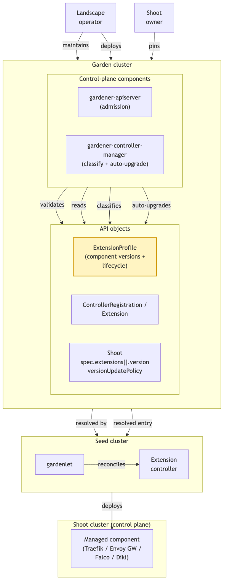
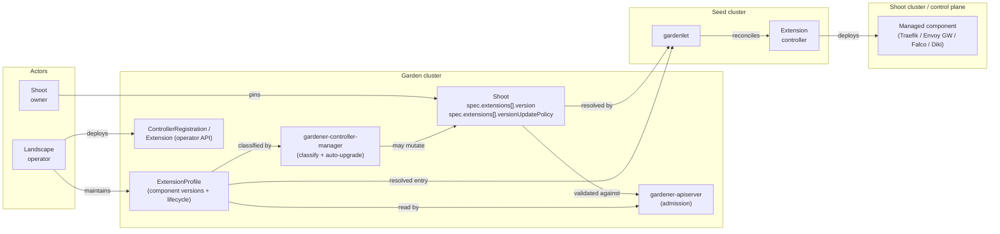
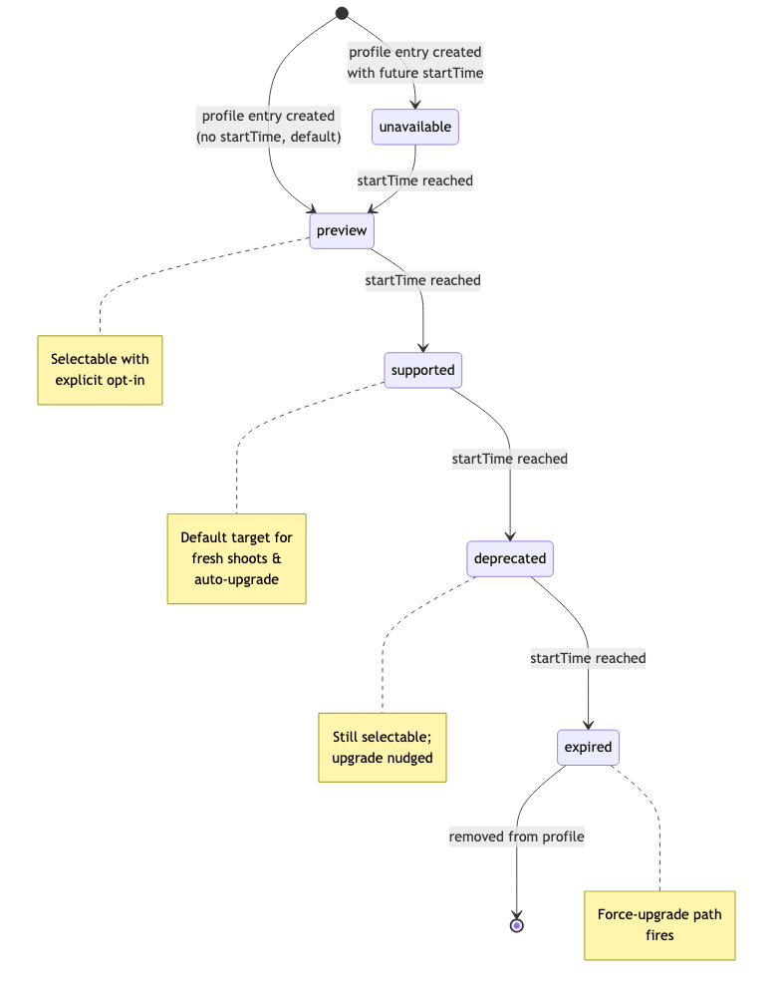
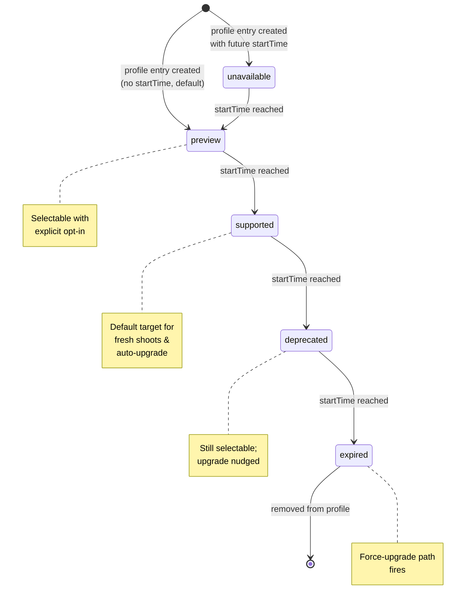
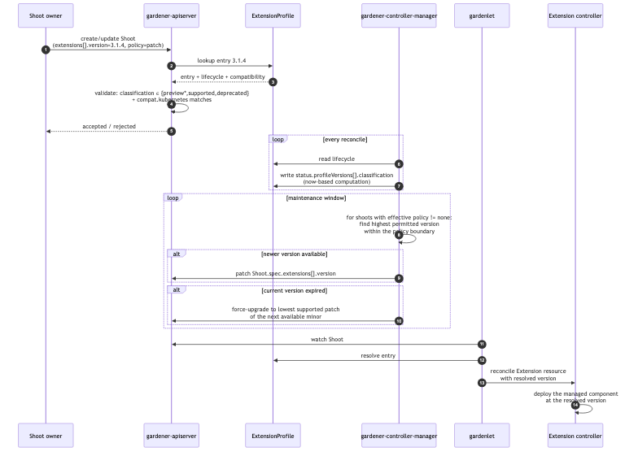
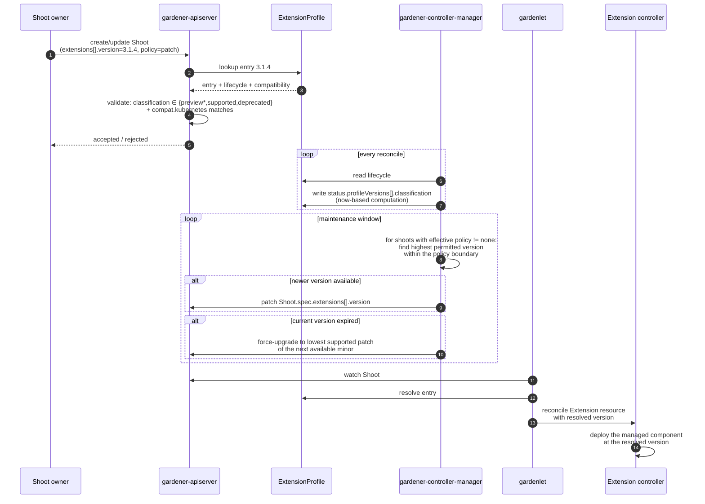

# GEP-78: A Homogeneous Version Profile for Extension-Managed Components

## Summary

A growing set of Gardener extensions manage a component whose version their
users legitimately care about — the ingress controller behind Traefik, the
gateway behind Envoy Gateway, the runtime-security agent behind Falco, the
scanner behind Diki. Today each of these extensions invents its own way to
answer the same three questions: *which component versions can I offer, how
do I classify them over time, and how do I upgrade them?* Falco ships a
bespoke `FalcoProfile` CRD; Traefik pins one component version per extension
release; Diki surfaces its version knobs inside a `ComplianceScan` CRD;
Envoy Gateway will land with yet another scheme. Every extension therefore
teaches its users a different mental model for the same problem.

This GEP proposes a **homogeneous version profile for extension-managed
components**, reusing the version-lifecycle model Gardener already applies to
Kubernetes and machine-image versions in `CloudProfile` (formalised in
[GEP-0032]). The unit of versioning is the *component* the extension installs
— **not** the extension controller binary, whose version is an operator
concern and is not visible to shoot owners.

The landscape operator maintains an **`ExtensionProfile`** resource per
participating extension type, listing the component versions on offer with a
`preview → supported → deprecated → expired` lifecycle. Shoot owners **pin** a
component version through the shoot's `spec.extensions[]` surface and may
**opt in to auto-upgrade** within a minor or patch boundary — the same UX
they already know from `spec.kubernetes.version`. The pin is optional: a
shoot that sets no version keeps today's behaviour, which lets each extension
adopt the model on its own timeline.

[GEP-0032]: ../0032-version-classification-lifecycle/README.md
[GEP-0057]: ../0057-replace-nginx-ingress-shoot-addon-with-traefik-extension/README.md
[PR-64]: https://github.com/gardener/enhancements/pull/64
[gardener-extension-falco]: https://github.com/gardener/gardener-extension-shoot-falco-service
[gardener-extension-envoy-gateway]: https://github.com/gardener/gardener-extension-envoy-gateway

## Motivation

Gardener has gained several new extensions — among them the Traefik, Falco,
Diki and Envoy Gateway extensions — that share a common property
distinguishing them from earlier extensions: their value proposition
*explicitly* includes giving the shoot owner control over the version of the
component being installed. Rather than tying the component version to
whatever the extension release happens to ship, these extensions aim to let
users schedule component updates themselves — always within the boundaries
(supported versions, deprecation windows, expiry dates) that the landscape
operator defines. This is the same freedom shoot owners already have for
their Kubernetes version, and the same guardrails.

The problem is that several extensions have arrived at this need
independently, and each has grown — or is about to grow — its own
version-management surface:

* The **Falco extension** ships a [`FalcoProfile`][gardener-extension-falco]
  CRD with a bespoke classification scheme. It has, in effect, already solved
  this problem for itself.
* The **Traefik extension** ([GEP-0057]) pins one component version per
  extension release.
* The **Diki extension** ([PR #64][PR-64]) surfaces `spec.dikiVersion` plus a
  list of rulesets with their own versions inside the `ComplianceScan` CRD.
* The **[Envoy Gateway extension][gardener-extension-envoy-gateway]** will
  land with its own version matrix.

The concern is not that any one of these approaches is wrong — Falco's
demonstrates that a per-extension profile CRD works. The concern is that
every extension is left to invent its own, so that:

* every new extension in this family re-invents versioning — cost paid N times,
* operators cannot build a single dashboard to reason about
  extension-managed-component version coverage across a landscape,
* shoot owners cannot script consistent policies ("stay on the latest
  supported minor, opt out of previews") across these extensions.

Gardener already solved these questions once, consistently, for Kubernetes
and machine-image versions in `CloudProfile`. This GEP proposes reusing that
same, proven model for the subset of extensions where user-facing component
versioning is part of the product, rather than letting each extension solve
it its own way.

**Relationship to `CloudProfile` and [GEP-0032].** The lifecycle vocabulary
and classification semantics this GEP builds on are those *implemented today*
in `CloudProfile` for Kubernetes and machine-image versions. [GEP-0032]
formalises and extends that model but is not yet fully implemented; this GEP
therefore anchors on the existing `CloudProfile` behaviour and tracks
[GEP-0032] as the direction of travel. Where the two diverge, the existing
implementation is the reference for this GEP.

### Goals

1. Provide **one** version-profile model for the subset of extensions that
   explicitly expose a managed-component version to shoot owners
   (currently: the Falco, Traefik, Diki and Envoy Gateway extensions).
2. Version the *managed component*, not the extension controller binary. The
   extension binary version is an operator concern owned by the deployment
   surfaces (`ControllerDeployment` / `Extension`) and is intentionally out
   of scope for this document.
3. Reuse the lifecycle classifications and status-computation semantics that
   `CloudProfile` implements today (and that [GEP-0032] formalises) —
   verbatim, with no parallel vocabulary.
4. Give shoot owners an explicit **pin** surface plus a documented
   **auto-upgrade** opt-in, and preserve the existing **force-upgrade** on
   expiry — mirroring the Kubernetes-version UX they already know.
5. Surface the computed classification of every profile entry on a
   dedicated status subresource of `ExtensionProfile` — computed by a
   named component (see [Design Details](#design-details)) so operators
   have a single place to inspect classification.
6. Define a well-known place and shape for the pinned component version on
   the shoot, so operators and shoot owners no longer need to open a
   provider-config schema to find it.

### Non-Goals

1. Changing *all* extensions to this model. Adoption is opt-in per extension,
   and extensions outside the family described above are neither in scope nor
   the target of this GEP.
2. Redefining the lifecycle vocabulary that `CloudProfile` / [GEP-0032]
   already establish. That work is done.
3. Prescribing which component versions any specific extension must ship.
   This GEP defines the *mechanism*; the concrete `ExtensionProfile` content
   is authored by the landscape operator, who knows the versions and
   time windows to offer.
4. Replacing `ControllerRegistration`, `ControllerDeployment` or the
   operator's `Extension` resource. This GEP adds *alongside* them.
5. Versioning the extension controller *binary*. That is an operator concern
   bound to the deployment surface (`ControllerDeployment` / `Extension`),
   not something shoot owners pin. Operators are expected to roll a
   matching `ExtensionProfile` and extension controller binary together.
6. Versioning components in runtime clusters (`garden` / `seed`). Scope is
   *shoot-facing* components only; a follow-up may extend the model.
7. Cross-component dependency resolution ("Envoy Gateway X requires
   cert-manager ≥ Y"). Left to a future GEP.

## Proposal

### Scope of participating extensions

This GEP applies to extensions that (a) manage a component with an
independent release cadence, and (b) already expose (or plan to expose) a
version knob to shoot owners. Concretely, the target set is:

* `gardener-extension-shoot-falco-service`
* `gardener-extension-shoot-traefik-service` ([GEP-0057])
* `gardener-extension-diki` ([PR #64][PR-64])
* `gardener-extension-envoy-gateway`

Other extensions — CNI, cloud-provider (including the cloud-controller-manager
they manage), OS extensions, and similar — remain unchanged. They already
have a versioning story that fits their nature (either `CloudProfile`-driven
or one-version-per-release) and this GEP has no ambition to touch them.

### Concept

The **landscape operator** maintains one **`ExtensionProfile`** resource per
participating extension type in the garden cluster. The operator is the actor
who knows which component versions the landscape should offer and on what
schedule they move through the lifecycle — the extension controller does not
carry that policy. The profile is the single source of truth for:

* which component versions this extension is allowed to deploy,
* the lifecycle stage of every version at any point in time,
* the compatibility envelope (currently: minimum Kubernetes version).

A named Gardener control-plane component (see
[Reconciliation](#admission-and-reconciliation) below) watches
`ExtensionProfile` and:

1. computes the current classification per version (identical algorithm to
   `CloudProfile.status.kubernetes.versions`),
2. validates every `Shoot.spec.extensions[]` entry against the profile
   on admission,
3. drives auto-upgrade for shoots that opted in during their maintenance
   window,
4. surfaces version status back on the `Shoot` for operators and shoot
   owners.

The full `ExtensionProfile` shape is in
[Design Details](#the-extensionprofile-resource); the actors, resources and
control loops are shown below.



<details><summary>Mermaid source (regenerate <code>actors.png</code> via <code>mmdc -i actors.mmd -o actors.png -b transparent</code>)</summary>



</details>

### Shoot-owner UX

Explicit pin, with opt-in auto-upgrade — same mental model as
`spec.kubernetes.version`:

```yaml
apiVersion: core.gardener.cloud/v1beta1
kind: Shoot
spec:
  extensions:
    - type: shoot-traefik
      version: "3.1.4"               # pin (optional)
      versionUpdatePolicy: patch     # patch | minor | latestSupported | none
      providerConfig:
        apiVersion: traefik.extensions.gardener.cloud/v1alpha1
        kind: TraefikConfig
        # ...
```

* Omitting `version` selects the latest `supported` version from the profile.
* `versionUpdatePolicy: patch` auto-upgrades to newer supported *patch*
  releases within the pinned minor (`3.1.4 → 3.1.7`).
* `versionUpdatePolicy: minor` auto-upgrades to newer supported *minor*
  releases within the pinned major (`3.1.4 → 3.2.0`), patches included.
* `versionUpdatePolicy: latestSupported` always tracks the newest `supported`
  version the profile offers, crossing major boundaries — the "keep me current"
  option for owners who want no version management at all.
* `versionUpdatePolicy: none` freezes on the pinned version until it hits
  `expired`, at which point the force-upgrade path fires — moving the shoot to
  a supported version rather than leaving it on an unsupported one (see
  the [force-upgrade path](#admission-and-reconciliation) for the exact
  target).

**Default policy.** If a shoot omits `versionUpdatePolicy`, the effective
default is *not* `none`: leaving a shoot frozen by default silently accumulates
components that will eventually force-upgrade, which is the opposite of what a
homogeneous, lifecycle-aware model should encourage. Instead the default is an
**automatic** policy, and the concrete default is configurable per extension via
`ExtensionProfile.spec.defaultVersionUpdatePolicy` (see
[Design Details](#the-extensionprofile-resource)). An extension whose landscape
operator sets no explicit default inherits `patch` — the least surprising
automatic policy, keeping shoots current on security and bug-fix releases
within their pinned minor without crossing a minor boundary unasked. An
operator that wants a different posture (for example `latestSupported` for a
component with a strong backward-compatibility guarantee, or `none` for a
component the operator upgrades itself) sets it on the profile.

**Interaction with sub-component versions.** Some managed components carry
sub-components with their own versions — Diki is the clearest example, pairing
a `dikiVersion` with a list of independently-versioned `rulesets`
([PR #64][PR-64]). This GEP versions the top-level component; finer-grained
sub-component versions stay inside the extension's own CRDs
(`ComplianceScan.spec.rulesets[]` in Diki's case). The set a given entry
supports is declared in that entry's optional `providerConfig`
(`supportedDikiVersions`), and the extension validates that a selected ruleset
combination is compatible with the pinned entry. A fully nested profile is
possible but out of scope for this iteration; the design does not preclude it.

### Constraints and caveats

* The profile is limited to components that publish versioned releases in
  a way the extension can enumerate. An extension whose component is not
  meaningfully versioned does not need a profile — this GEP does not
  force one on it.
* **Version-string format.** Semver is the *preferred* format because it
  is what [GEP-0032]'s classifier expects. Components that publish
  non-semver versions (Diki's `v0.24`, calendar versioning, epoch tags)
  MUST be wrapped in a semver-compatible facade at profile level, as
  GardenLinux already does for OS versions. If an extension cannot
  reasonably map its versions to semver — for example because ordering
  semantics differ — the profile MUST document its ordering rules and
  ship a comparator in the shared library entry it registers. The
  ordering is a hard constraint of the auto-upgrade logic; nothing works
  without a total order.
* One `ExtensionProfile` per extension type; multiple co-existing
  profiles for the same extension type are rejected on admission.

### Risks and Mitigations

| Risk                                                                       | Likelihood | Impact | Mitigation                                                                                                                     |
| ---                                                                        | ---        | ---    | ---                                                                                                                            |
| Participating extensions adopt the profile inconsistently                  | Medium     | High   | The four in-scope extensions land on the same shared library (see Design Details); admission enforces the shape.               |
| Force-upgrades break stateful components (Falco rulesets, Traefik CRDs)    | Low        | High   | Per-version compatibility metadata; operator-configurable grace window before expiry.                                          |
| Non-semver versions produce surprising auto-upgrade orderings              | Medium     | Medium | Semver facade required; ordering rules documented per profile; force-upgrade never crosses a facade boundary silently.         |
| Auto-upgrade surprises shoot owners                                        | Medium     | Medium | Default policy is the conservative automatic `patch` (operator-tunable per profile); every upgrade emits a `Shoot` event with source and target version, and stays within the pinned minor unless the owner opts into `minor`/`latestSupported`. |

## Design Details

### The `ExtensionProfile` resource

```yaml
apiVersion: core.gardener.cloud/v1beta1
kind: ExtensionProfile
metadata:
  name: shoot-traefik
spec:
  # Which extension type this profile is for. Must match the `type` field
  # used in Shoot.spec.extensions[].type and in the ControllerRegistration.
  type: shoot-traefik

  # The automatic policy applied to shoots of this type that do not set an
  # explicit Shoot.spec.extensions[].versionUpdatePolicy. Optional; if unset,
  # gardener-apiserver defaults it to `patch`. One of
  # patch | minor | latestSupported | none.
  defaultVersionUpdatePolicy: patch

  profileVersions:
    - # A profile entry is a single component version moving through the
      # lifecycle.
      version: "3.1.4"
      # Compatibility envelope, evaluated on admission.
      compatibility:
        kubernetes:
          minimum: "1.28"
          maximum: "1.32"
      # Identical shape to CloudProfile.spec.kubernetes.versions[].lifecycle.
      lifecycle:
        - classification: preview
        - classification: supported
          startTime: "2026-07-15T00:00:00Z"
        - classification: deprecated
          startTime: "2026-11-01T00:00:00Z"
        - classification: expired
          startTime: "2026-12-15T00:00:00Z"

    - version: "3.2.0"
      compatibility:
        kubernetes:
          minimum: "1.30"
      lifecycle:
        - classification: preview
          startTime: "2026-08-01T00:00:00Z"

status:
  # Computed by the gardener-controller-manager on every reconcile — the
  # same algorithm that produces CloudProfile.status.kubernetes.versions.
  # Only entries the shoot owner can actually select are meaningful here;
  # `unavailable`/`expired` entries are surfaced but not selectable.
  profileVersions:
    - version: "3.1.4"
      classification: supported
    - version: "3.2.0"
      classification: unavailable        # startTime is in the future
```

Each profile entry is a single component `version` carrying its own
`lifecycle` and `compatibility`. The lifecycle, compatibility and
classification apply to the entry: it is promoted, deprecated and expired as a
unit, so a shoot owner reasons about exactly one version per pin.

Deliberately absent from this spec:

* No `minimumControllerVersion` / `controllerVersion`. Operators
  deploy the profile and the matching extension controller as one unit;
  a per-entry gate on the controller version is not enforceable and
  would give a false sense of safety.
* No `dependencies` bundle. The extension controller already knows
  which auxiliary images and charts correspond to a given component
  version — encoding that in the profile duplicates state and forces
  operators to keep two representations in sync. The extension chooses
  what to install when handed a resolved version.
* No `incompatibleWith`. There is no evidence yet of a real coexistence
  conflict this field would need to express. If one arises, it can be
  added in a follow-up without breaking the schema.

#### Optional per-entry `providerConfig`

Each profile entry MAY carry an **optional `providerConfig`** — a
`RawExtension` whose shape is owned by the extension, exactly as
`Shoot.spec.extensions[].providerConfig` is today. The core schema stays
homogeneous (`versions`, `lifecycle`, `compatibility`, `classification` are
the same for everyone); `providerConfig` is the escape hatch for the
extension-specific metadata an entry needs that the shared fields do not
capture. `gardener-apiserver` treats it opaquely — it is not validated
against the profile on admission; the extension controller decodes and acts
on it when it resolves the entry.

Typical uses:

* pinning the exact **image reference** to deploy for this entry, when the
  extension does not derive it from the version string alone;
* declaring the **sub-component versions** an entry supports (Diki's
  `supportedDikiVersions`), so the extension can validate a
  `ComplianceScan`'s ruleset selection against the pinned entry.

```yaml
profileVersions:
  - version: "0.24.0"                   # the diki component version
    lifecycle:
      - classification: supported
        startTime: "2026-07-01T00:00:00Z"
    # Optional, opaque to gardener-apiserver, decoded by the Diki extension.
    providerConfig:
      apiVersion: diki.extensions.gardener.cloud/v1alpha1
      kind: DikiProfileConfig
      image: europe-docker.pkg.dev/gardener-project/releases/diki:v0.24.0
      supportedDikiVersions:
        - "v0.23"
        - "v0.24"
```

Because it is optional and per-entry, an extension that needs none of this
(Traefik in the examples above) simply omits it, and the entry stays a pure
`versions` + `lifecycle` bundle.

#### Falco — replacing the bespoke `FalcoProfile`

Falco already solves component versioning for itself with a bespoke
`FalcoProfile` CRD and its own classification scheme. Under this GEP it becomes
an ordinary single-component profile — the homogeneous shape replaces the
bespoke CRD verbatim:

```yaml
apiVersion: core.gardener.cloud/v1beta1
kind: ExtensionProfile
metadata:
  name: shoot-falco
spec:
  type: shoot-falco
  profileVersions:
    - version: "0.38.1"
      compatibility:
        kubernetes:
          minimum: "1.28"
      lifecycle:
        - classification: supported
          startTime: "2026-07-01T00:00:00Z"

    - version: "0.39.0"
      lifecycle:
        - classification: preview
          startTime: "2026-08-01T00:00:00Z"
```

A shoot owner pins one `falco` version, exactly as with Traefik. Anything Falco
ships alongside the engine that is not independently selectable by the shoot
owner remains the extension's own concern — the extension decides what
auxiliary parts to install for a resolved version, the same way it decides
which charts and images to deploy. This replaces the bespoke `FalcoProfile` CRD
with the homogeneous shape while keeping the shoot-owner surface a single
version.

#### Diki — show only usable versions; upgrades owned by the Diki operator

Diki has two properties that make it different from Traefik/Falco:

1. **Only usable versions are surfaced to the shoot owner.** The
   `ExtensionProfile.status.profileVersions[]` list is filtered by the
   consuming client (dashboard, CLI) to the entries the owner can actually
   select — i.e. classification `supported` or `deprecated` (and `preview`
   only when the owner opts in). Entries that are `unavailable` or `expired`
   are not offered as choices. The shoot owner consumes this list directly
   and pins one of the usable versions.
2. **Auto-upgrade is *not* driven by `gardener-controller-manager` for
   Diki.** The Diki operator schedules and applies component upgrades itself,
   on its own cadence, because a compliance scan must move between ruleset
   versions in a controlled way rather than on the generic maintenance-window
   loop. Accordingly, a Diki shoot uses `versionUpdatePolicy: none`, and the
   generic auto-upgrade / force-upgrade loop described in
   [Admission and reconciliation](#admission-and-reconciliation) does not
   apply. Diki's own operator owns moving the pinned version forward. So that
   individual shoot owners do not each have to remember to opt out, the Diki
   `ExtensionProfile` sets `spec.defaultVersionUpdatePolicy: none` — Diki
   shoots then inherit the exemption by default rather than the fleet-wide
   `patch` default.

The Diki profile therefore looks like an ordinary single-component entry
(one `version` named `diki` per entry) carrying its supported sub-component
versions in the optional `providerConfig` shown
[above](#optional-per-entry-providerconfig):

```yaml
apiVersion: core.gardener.cloud/v1beta1
kind: ExtensionProfile
metadata:
  name: shoot-diki
spec:
  type: shoot-diki
  # Diki owns its own upgrades, so its shoots default to no auto-upgrade.
  defaultVersionUpdatePolicy: none
  profileVersions:
    - version: "0.24.0"
      lifecycle:
        - classification: supported
          startTime: "2026-07-01T00:00:00Z"
      providerConfig:
        apiVersion: diki.extensions.gardener.cloud/v1alpha1
        kind: DikiProfileConfig
        image: europe-docker.pkg.dev/gardener-project/releases/diki:v0.24.0
        supportedDikiVersions:
          - "v0.23"
          - "v0.24"
```

The cluster owner picks a usable `diki` version and pins it; the Diki
operator, not the controller-manager, is responsible for advancing it and for
validating the `ComplianceScan` ruleset selection against
`supportedDikiVersions`.

### Where the shoot pins the version

The pin lives on `Shoot.spec.extensions[].version` and
`Shoot.spec.extensions[].versionUpdatePolicy` — new fields on the existing
`ExtensionResourceState` structure. Placing them on the shoot's core API
(not inside `providerConfig`) is intentional: the shoot-owner-visible
knob for a *homogeneous* mechanism must be discoverable without opening
each extension's provider-config schema, and admission validation
against the profile has to work on stable typed fields, not on a
`RawExtension` whose shape belongs to the extension.

**`version` is optional, and this is the whole adoption story.** If a shoot
sets no `version` for an extension, the extension behaves exactly as it does
today — the profile is not consulted and nothing changes. An extension only
starts participating once (a) the landscape operator publishes an
`ExtensionProfile` for its type and (b) shoots begin setting `version`.
Because the field is optional and defaulted to "unset = legacy behaviour",
every extension can switch to this model independently, at any time, without
a coordinated flag day and without breaking existing shoots. Extensions that
surface a component version inside their provider-config today (Diki's
`spec.dikiVersion` in the `ComplianceScan` CRD, Falco's `FalcoProfile`
selection) move the canonical pin to `Shoot.spec.extensions[].version` and
deprecate the legacy field on their own timeline.

### Admission and reconciliation

The version-lifecycle state machine — identical to [GEP-0032], reproduced
here for reference:



<details><summary>Mermaid source (regenerate <code>lifecycle.png</code> via <code>mmdc -i lifecycle.mmd -o lifecycle.png -b transparent</code>)</summary>



</details>

The end-to-end flow for a shoot referencing an extension-managed-component
version:



<details><summary>Mermaid source (regenerate <code>flow.png</code> via <code>mmdc -i flow.mmd -o flow.png -b transparent</code>)</summary>



</details>

**Concretely responsible components:**

1. **Admission — `gardener-apiserver`**
   * `Shoot.spec.extensions[].version` must exist in the referenced
     `ExtensionProfile`.
   * Selected version must be in classification `preview` (with explicit
     opt-in), `supported`, or `deprecated`. `unavailable` and `expired`
     are rejected.
   * `compatibility.kubernetes` must satisfy the shoot's Kubernetes
     version.
   * If `Shoot.spec.extensions[].versionUpdatePolicy` is unset, it is
     defaulted to the profile's `spec.defaultVersionUpdatePolicy`, and if that
     too is unset, to `patch`. The effective policy is one of
     `patch | minor | latestSupported | none`.
   * If an extension does not support every `versionUpdatePolicy` value, the
     unsupported policies are rejected — including as the resolved default, so
     an operator cannot set a `defaultVersionUpdatePolicy` the extension does
     not implement. *How* an extension advertises which policies it supports
     (for example a field on the `ControllerRegistration`, or a capability on
     the `ExtensionProfile` itself) is an open detail to be settled during
     implementation.

2. **Classification and auto-upgrade — `gardener-controller-manager`**
   * Compute `ExtensionProfile.status.profileVersions[].classification` from
     `lifecycle` and current time — reusing the [GEP-0032]
     implementation.
   * For each shoot whose effective `versionUpdatePolicy != none`, evaluate
     whether a newer permitted entry exists within the policy's boundary
     (`patch` → same minor, `minor` → same major, `latestSupported` → any);
     if so, patch `spec.extensions[].version` during the next maintenance
     window.
   * On `expired`, apply the force-upgrade path.
   * **Exemption.** An extension may own upgrades itself, in which case its
     shoots use `versionUpdatePolicy: none` and this loop performs no
     auto-upgrade for them. **Diki** is such a case: the Diki operator
     schedules component moves on its own cadence (see the
     [Diki section](#diki--show-only-usable-versions-upgrades-owned-by-the-diki-operator)),
     so the controller-manager only classifies its profile and validates
     admission — it does not advance Diki versions.

3. **Force-upgrade path — `gardener-controller-manager`**
   * When a shoot's pinned version transitions to `expired`, the
     controller-manager patches `spec.extensions[].version` to the
     *lowest supported patch of the next available minor* (staying on the
     current minor only if it still has a supported patch). It never targets
     an unsupported version — an expiring `1.32.7` moves to the lowest
     supported `1.33.x`, not to `1.33.0`. This is the same component that
     runs auto-upgrade; the force-upgrade is the special case of the
     auto-upgrade loop that also applies to shoots with `policy == none`.

4. **Deployment — `gardenlet` and extension controller**
   * `gardenlet` reads the resolved version from the shoot and passes it
     to the extension controller via the existing `Extension` resource
     contract (the `extensions.gardener.cloud/v1alpha1.Extension`
     resource on the seed).
   * The extension controller is *told* which version to deploy —
     everything auxiliary (charts, images, sidecars) remains its
     internal concern, as it is today.

### Shared implementation library

To keep the four in-scope extensions genuinely homogeneous rather than
"homogeneous in spirit", this GEP ships a Go module under
`github.com/gardener/gardener/extensions/pkg/versioning` providing:

* the `ExtensionProfile` types,
* a resolver — `Resolve(shoot, profile) (Entry, error)` — that every
  participating extension calls in the same way. The returned `Entry` carries
  the resolved component `version` (plus the entry's optional `providerConfig`),
  so the extension receives exactly what it must deploy,
* the [GEP-0032] classification-computation function, imported verbatim,
* admission-plugin building blocks that the `gardener-apiserver`
  registers per participating extension type.

Concretely, the four in-scope extensions depend on this Go module, replace
their bespoke version-selection code with calls into it, and cut their next
release — nothing more elaborate than a Go module import.

## Drawbacks

* Every participating extension maintainer must invest in adopting the
  profile and the shared library. Even within the four in-scope
  extensions this is real engineering cost — most acute for Falco,
  which has to retire an existing `FalcoProfile` surface with real
  users on it.
* Introduces a new top-level resource (`ExtensionProfile`), adding
  cognitive load for operators — though the shape deliberately mirrors
  `CloudProfile` to keep the learning gradient small.
* Auto-upgrade adds a new failure mode: a component upgrade may
  destabilise a shoot outside of an owner-initiated action. Confining the
  default to `patch`, emitting an event per upgrade, and letting operators
  choose a more conservative default (down to `none`) per profile soften
  this but cannot eliminate it.
* Extensions that adopt the shared Go module couple their release
  cadence to `gardener/gardener` — the same coupling as
  `extensions/pkg/controller` already, and no worse; but it is real.

## Alternatives

### Extend `CloudProfile` with an `extensions` section

Rejected. The natural home would be
`CloudProfile.spec.extensions[].versions[]`, mirroring `machineImages`.
It reuses a proven surface, but there is a fundamental mismatch: a
`CloudProfile` is *specific to one infrastructure* (its machine types,
images and regions are provider-bound), whereas the extensions in scope
here — Traefik, Falco, Diki, Envoy Gateway — are largely
*infrastructure-independent*. Their component versions do not vary by
cloud provider, so pinning them inside per-provider `CloudProfile`s would
force the same version matrix to be duplicated and kept in sync across
every profile in a landscape. On top of that, `CloudProfile` is already
unwieldy in large landscapes — the resource is large, changes to it are
politically expensive, and every version bump would require touching each
cloud profile across an operator's fleet. A separate `ExtensionProfile`
per-extension-type keeps churn scoped to the extension that owns the
change and keeps infrastructure-independent versioning out of an
infrastructure-specific resource.

### Version only the extension binary

Rejected. This is the current Traefik model and is the problem this GEP
sets out to solve: it ties the component version to the extension release
cadence, so shoot owners cannot schedule component updates independently of
whenever a new extension binary happens to ship.

### Per-extension bespoke profile (the `FalcoProfile` pattern)

**Not rejected in principle — this GEP is a stricter, homogeneous
variant of the same pattern.** Falco's `FalcoProfile` already
demonstrates that a per-extension profile CRD can work: an extension
publishes a CRD listing the component versions it can deploy, with
per-version lifecycle metadata. The trade-off is *homogeneity* — every
extension inventing its own profile CRD means every extension teaches
users a different mental model, and none of them share the [GEP-0032]
classification algorithm. This GEP argues that when four extensions
converge on the same need, a single shared shape is worth the switching
cost. If the community concludes otherwise, keeping `*Profile` CRDs
per-extension (with a shared documentation convention) is a legitimate
fallback.

### Release channels (GKE-style `rapid` / `regular` / `stable`)

Considered. Instead of pinning a specific version, the shoot owner would
subscribe to a channel and let Gardener choose the version. This has real
appeal for operational simplicity and matches how GKE, EKS and AKS handle
Kubernetes upgrades today.

Rejected for this iteration for three reasons:

1. **Explicit control is a requirement for the in-scope extensions.**
   Compliance scanners (Diki), ingress controllers (Traefik, Envoy
   Gateway) and security tooling (Falco) are cases where shoot owners
   have concrete reasons to pin a specific version — compliance
   frameworks target specific ruleset versions, application routing
   depends on specific controller versions. Channels give up that
   control by design.
2. **Channels layer *on top of* an explicit-version model.** A channel
   is defined as "the highest supported version in tier X"; you need
   the classified-version primitive first. This GEP delivers that
   primitive.
3. **`versionUpdatePolicy: minor` covers a large fraction of the
   channel value proposition already** — it says "auto-upgrade within
   this minor" without asking the shoot owner to opt out of pinning.

Channels remain a natural follow-up once the profile is established: a
future GEP could add a `channel` field on `Shoot.spec.extensions[]` that
resolves to a version via the profile, without any change to the profile
shape itself.

### Two-level versioning (extension binary version × component profile)

Deferred. Expressive but adds a second axis operators and shoot owners
must reason about, without a compelling near-term use case. The pin
lives on the component version; the extension-binary version stays an
operator concern on the deployment surface. If a real coupling
constraint appears, it can be added as a `compatibility.controller`
field without a schema break.