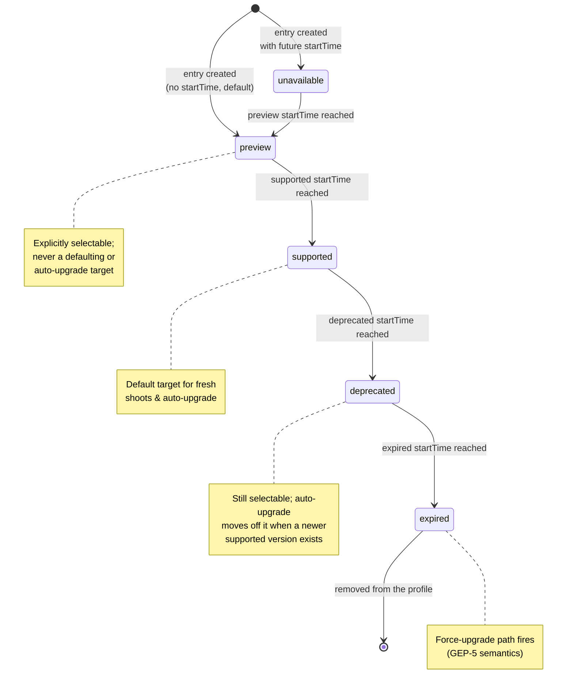
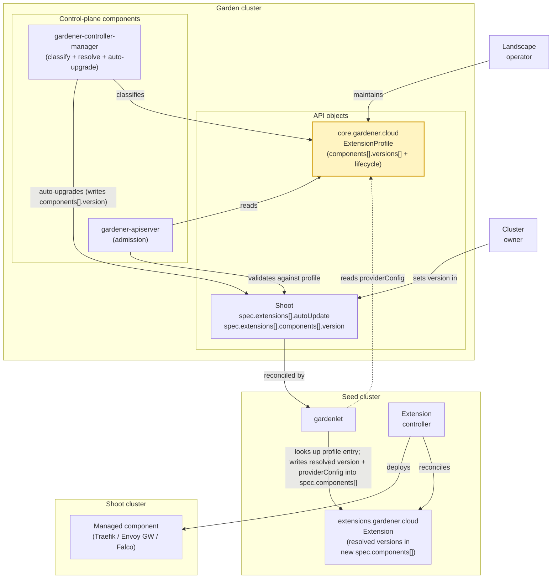
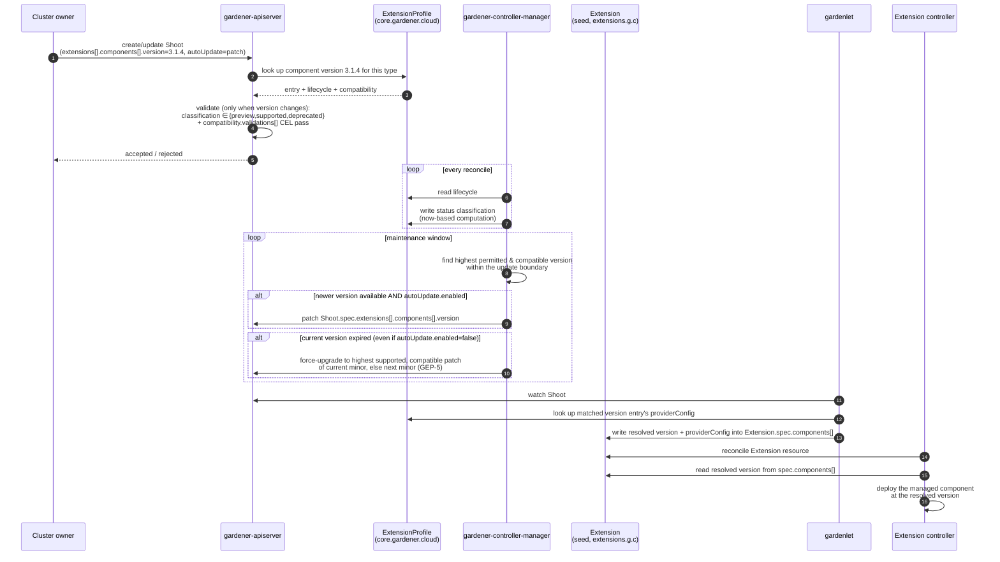

# GEP-78: Homogeneous Version Profile for Extension-Managed Components

## Summary

This GEP proposes a **homogeneous version profile for extension-managed
components**, reusing the version-lifecycle model Gardener already applies to
Kubernetes and machine-image versions in `CloudProfile` (the classification
lifecycle formalised in [GEP-32], the force-upgrade semantics in
[GEP-5]). The unit of versioning is the *component* the extension installs
— **not** the extension controller binary, whose version is an operator
concern and is not visible to shoot owners.

The landscape operator lists the offered component versions — with a
`preview → supported → deprecated → expired` lifecycle — in a dedicated
**`ExtensionProfile`** resource, one per participating extension type,
side-by-side with (not inlined into) the `Extension` resource that registers
the extension. This keeps the version list on its own `CloudProfile`-style
object rather than overloading the extension-registration surface. Cluster
owners **pin** a component version through the shoot's `spec.extensions[]`
surface and may **opt in to auto-upgrade** within a patch, minor, or major
boundary — the same UX they already know from `spec.kubernetes.version`.

`gardener-controller-manager` classifies the profile and drives auto-upgrade and
force-upgrade by **resolving the effective version onto the `Shoot` spec** in the
garden cluster — writing only the typed
`Shoot.spec.extensions[].components[].version` field. From there the resolved
version reaches the extension through the seed-side `Extension` resource
(`extensions.gardener.cloud/v1alpha1`): `gardenlet` looks up the matched
`ExtensionProfile` version entry and carries the resolved version — together with
that entry's optional `providerConfig` — into a **new typed
`Extension.spec.components[]`** field on the seed. The existing opaque
`Extension.spec.providerConfig` keeps its current meaning and is not overloaded with
resolved versions. The extension controller reconciles the `Extension` resource and
reads the resolved version from `spec.components[]`.

[GEP-5]: ../0005-versioning-policy/README.md
[GEP-32]: ../0032-version-classification-lifecycle/README.md
[GEP-57]: ../0057-replace-nginx-ingress-shoot-addon-with-traefik-extension/README.md
[GEP-63]: ../0063-diki-extension/README.md
[GEP-68]: ../0068-gateway-api-extension/README.md
[gardener-extension-falco]: https://github.com/gardener/gardener-extension-shoot-falco-service

## Motivation

A growing set of Gardener extensions manage a component whose version their
users legitimately care about — the ingress controller behind Traefik, the
gateway behind Envoy Gateway, the runtime-security agent behind Falco, and the
scanner behind Diki. Their value proposition *explicitly* includes giving the cluster
owner control over the version of the installed component: rather than tying
that version to whatever the extension release happens to ship, these
extensions aim to let users schedule component updates themselves — within the
supported-versions / deprecation-window / expiry-date boundaries the landscape
operator defines, i.e. the same freedom and guardrails shoot owners already
have for their Kubernetes version.

The problem is that several extensions have arrived at this need
independently, and each has grown — or is about to grow — its own
version-management surface:

* The **Falco extension** ([`gardener-extension-shoot-falco-service`][gardener-extension-falco],
  type `shoot-falco-service`) ships a bespoke `FalcoProfile` CRD with its own
  classification scheme. It has, in effect, already solved this problem for
  itself.
* The **Traefik extension** ([GEP-57], type `shoot-traefik`) pins one
  component version per extension release.
* The **Envoy Gateway extension** ([GEP-68], type `envoy-gateway`) lands with
  its own version matrix.

Not every extension that surfaces a version fits this model. The **Diki
extension** ([GEP-63], type `diki`) surfaces a `dikiVersion` (the scanner) plus a
list of independently-versioned rulesets inside its `ComplianceScan` CRD, but its
available versions are determined by the `diki-operator` and the `diki-extension`
release rather than by an operator-curated rollout schedule — so it needs no
classification lifecycle and is **not a participant** here (see
[Non-participating extensions](#non-participating-extensions)).

The concern is not that any one of these approaches is wrong — Falco's
demonstrates that a per-extension profile can work. The concern is that every
extension is left to invent its own, so that:

* every new extension in this family re-invents versioning — cost paid N times,
* operators cannot build a single dashboard to reason about
  extension-managed-component version coverage across a landscape,
* cluster owners cannot script consistent policies ("stay on the latest
  supported minor, opt out of previews") across these extensions.

Gardener already solved these questions once, consistently, for Kubernetes and
machine-image versions in `CloudProfile`. This GEP reuses that proven model for
the subset of extensions where user-facing component versioning is part of the
product.

**Relationship to `CloudProfile`, [GEP-32] and [GEP-5].** The lifecycle
vocabulary and classification semantics this GEP builds on are those
*implemented today* in `CloudProfile` for Kubernetes and machine-image
versions. [GEP-32] formalises the classification lifecycle; [GEP-5]
defines the versioning policy, including the force-upgrade behaviour on expiry.
Where the two diverge from the existing implementation, the existing
implementation is the reference for this GEP.

### Goals

1. Provide **one** `ExtensionProfile` model for extensions that explicitly
   expose a managed-component version to cluster owners (the set discussed in
   [Motivation](#motivation)).
2. Version the *managed component(s)*, not the extension controller binary. The
   binary version is an operator concern owned by the deployment surfaces
   (`ControllerDeployment` / `Extension` registration) and is out of scope here.
3. Support extensions that manage **more than one** component: the profile lists
   named `components`, each with its own independently-versioned `versions`.
4. Reuse the lifecycle classifications and status-computation semantics that
   `CloudProfile` implements today ([GEP-32]) — verbatim, with no parallel
   vocabulary.
5. Give cluster owners an explicit **pin** surface plus a documented
   **auto-upgrade** opt-in, and preserve **force-upgrade** on expiry with the
   same patch-then-minor target semantics [GEP-5] defines for Kubernetes
   versions (exact target rule in [Design Details](#design-details)).
6. Resolve the pinned version to the extension through the seed `Extension`
   resource: `gardener-controller-manager` writes the resolved
   `Shoot.spec.extensions[].components[].version`, and `gardenlet` carries the
   resolved version plus the profile entry's optional `providerConfig` into a new
   typed `Extension.spec.components[]` field on the seed, without overloading the
   opaque `spec.providerConfig`.

### Non-Goals

1. Forcing *all* extensions onto this model. Extensions that do not expose a
   component version to users are out of scope. However, any extension that
   *does* want to offer user-facing component-version control **should** adopt
   this model rather than invent its own; a per-extension bespoke profile is
   [rejected in principle](#per-extension-bespoke-profile-the-falcoprofile-pattern).
2. Redefining the lifecycle vocabulary that `CloudProfile` / [GEP-32]
   establish.
3. Prescribing which component versions any specific extension must ship. This
   GEP defines the *mechanism*; the concrete profile content is authored by the
   landscape operator.
4. Replacing `ControllerRegistration`, `ControllerDeployment` or the
   `Extension` registration resource. This GEP adds *alongside* them (a new
   `ExtensionProfile` resource).
5. Versioning the extension controller *binary*. Operators roll a matching
   profile and controller binary together.
6. Versioning components in runtime clusters (`garden` / `seed`). Scope is
   *shoot-facing* components only; a follow-up may extend the model.
7. Per-worker-pool component versions (e.g. a distinct GPU-driver version per
   pool). No concrete requirement exists yet; the named-entry structure does
   not preclude adding a pool selector later.
8. Cross-component dependency resolution ("Envoy Gateway X requires
   cert-manager ≥ Y"). Left to a future GEP.

## Proposal

### Scope of participating extensions

The target set is the extensions discussed in [Motivation](#motivation)
(Falco, Traefik and Envoy Gateway). Diki looks
similar but does **not** participate — its versions are release-coupled rather
than operator-curated (see
[Non-participating extensions](#non-participating-extensions)). Other
extensions — CNI, cloud-provider, OS extensions, and similar — remain
unchanged; they already have a versioning story that fits their nature and this
GEP has no ambition to touch them.

### The `ExtensionProfile` resource

The **landscape operator** maintains one **`ExtensionProfile`** resource per
participating extension type, deployed side-by-side with the `Extension`
resource that registers the extension in the garden cluster. Keeping the
version list on its own object, rather than inlining it into the extension
registration:

* mirrors `CloudProfile` — the operator reasons about the `ExtensionProfile`
  with the same mental model and (potentially) the same tooling;
* keeps the version lifecycle policy separate from the extension-deployment
  surface, so the two can evolve and be reviewed independently;
* the operator is the actor who knows which component versions the landscape
  should offer and on what schedule — the extension controller does not carry
  that policy.

The profile is bound to an extension type by requiring `metadata.name` to equal
the extension `type` (no separate `spec.type` field is needed), so a
`Shoot.spec.extensions[]` entry of `type: shoot-traefik` resolves to the
`ExtensionProfile` named `shoot-traefik`. This binding is what lets admission
validate a pin and lets the resolve loop patch the version onto the shoot's
`spec.extensions[]` entry.

```yaml
apiVersion: core.gardener.cloud/v1beta1
kind: ExtensionProfile
metadata:
  # Equals the extension `type` (Shoot.spec.extensions[].type / the
  # ControllerRegistration). name == type is the binding; no separate field.
  name: shoot-traefik
spec:
  # The auto-update policy for this extension type. `default` is applied to
  # shoots that do not set an explicit autoUpdate; `supported` is the allow-list
  # of strategies this extension implements — admission rejects any shoot (or
  # default) requesting a strategy not listed. A per-version updateStrategy
  # (below) overrides this profile-level default for that version.
  updateStrategy:
    default: patch                      # patch | minor | major
    supported: [patch, minor, major]
  # Each extension offers one or more named components, and each component moves
  # a list of versions independently through the lifecycle. A single-component
  # extension lists one component (e.g. the component's own name).
  components:
  - name: traefik
    # Per-component auto-update policy, overriding spec.updateStrategy for this
    # component. Optional; inherits the profile-level default when omitted.
    updateStrategy:
      default: patch                    # patch | minor | major
      supported: [patch, minor, major]
    versions:
    - version: "3.1.4"
      # Compatibility envelope, evaluated on admission: a list of CEL rules,
      # ANDed, against the shoot resource — the same shape as the CRD
      # x-kubernetes-validations feature. The CEL environment binds `self` to the
      # Shoot being admitted, so rules read e.g. self.spec.kubernetes.version or
      # self.spec.provider.workers[].machine.image.
      compatibility:
        validations:
        - message: "Requires Kubernetes 1.32 or newer"
          rule: "self.spec.kubernetes.version.matches('^1\\\\.(3[2-9]|[4-9][0-9])')"
        - message: "Only supported on Garden Linux worker nodes"
          rule: "self.spec.provider.workers.all(w, w.machine.image.name == 'gardenlinux')"
      # Identical shape to CloudProfile version lifecycles ([GEP-32]).
      lifecycle:
        - classification: preview
        - classification: supported
          startTime: "2026-07-15T00:00:00Z"
        - classification: deprecated
          startTime: "2026-11-01T00:00:00Z"
        - classification: expired
          startTime: "2026-12-15T00:00:00Z"
    - version: "3.2.0"
      compatibility:
        validations:
        - message: "Requires Kubernetes 1.33 or newer"
          rule: "self.spec.kubernetes.version.matches('^1\\\\.(3[3-9]|[4-9][0-9])')"
      lifecycle:
        - classification: preview
          startTime: "2026-08-01T00:00:00Z"
  - name: proxy
    # A second, independently-versioned component of the same extension.
    versions:
    - version: "1.0.0"
      lifecycle:
        - classification: supported
          startTime: "2026-07-15T00:00:00Z"

status:
  # Computed by gardener-controller-manager on every reconcile — the same
  # algorithm that produces CloudProfile version classifications. Mirrors the
  # spec.components[] structure.
  components:
  - name: traefik
    versions:
    - version: "3.1.4"
      classification: supported
    - version: "3.2.0"
      classification: unavailable        # startTime is in the future
  - name: proxy
    versions:
    - version: "1.0.0"
      classification: supported
```

A profile offers a list of named `components`; each component carries its own
`updateStrategy` override (optional) and its own list of `versions`. A version
entry is a single `version` string carrying its own `lifecycle` and
`compatibility`; it is promoted, deprecated and expired as a unit, independently
of the other versions of its component and of the other components. The
`updateStrategy` override, by contrast, is set **per component**, not per
version. This lets one extension type offer
several components that version independently (`traefik` and `proxy` above). The
`patch | minor | major` values intentionally mirror the `CloudProfile`
machine-image `updateStrategy` field (`MachineImageUpdateStrategy`, which has
exactly those three values). There is no `updateStrategy` value for "freeze on
this version": opting out of automatic upgrades is expressed by the boolean
`autoUpdate.enabled: false` on the Shoot (see
[How a cluster owner pins a version](#how-a-cluster-owner-pins-a-version)),
exactly as Gardener disables machine-image auto-updates via
`Shoot.spec.maintenance.autoUpdate.machineImageVersion: false` rather than a
sentinel strategy value.

Deliberately absent:

* No `controllerVersion` gate. Operators roll the profile and controller binary
  as one unit; a per-entry gate would give a false sense of safety.
* No `dependencies` bundle. The extension controller already knows which
  auxiliary images and charts correspond to a resolved version; encoding that
  here duplicates state.

#### Optional per-version `providerConfig`

Each version entry MAY carry an **optional `providerConfig`** — a
`RawExtension` whose shape is owned by the extension. The core fields
(`version`, `lifecycle`, `compatibility`, `classification`)
stay homogeneous for everyone; `providerConfig` is the escape hatch for
extension-specific metadata a version needs. `gardener-apiserver` treats it
opaquely. It is **not** written into the `Shoot` spec: when a version is
resolved, `gardenlet` looks up the matched profile version entry and carries its
`providerConfig` into the seed `Extension.spec.components[].providerConfig`
field (see [Deployment](#design-details)), where the extension controller
decodes it. The `Shoot` only ever carries the resolved `components[].version`.

Because it is optional and per-version, an extension that needs none of it (for
example Traefik) simply omits it, and the entry stays a pure `version` +
`lifecycle` bundle.

One legitimate use is per-version metadata the extension controller needs to
decode a specific release, such as a version-specific chart or CRD bundle
reference:

```yaml
components:
- name: some-component
  versions:
  - version: "3.2.0"
    lifecycle:
      - classification: preview
        startTime: "2026-08-01T00:00:00Z"
    # Optional, opaque to gardener-apiserver, decoded by the extension.
    providerConfig:
      apiVersion: example.extensions.gardener.cloud/v1alpha1
      kind: ComponentVersionConfig
      crdBundle: "component-crds-v3.2"
```

This GEP versions and lifecycles the **top-level component only**.
Independently-versioned sub-components that the extension manages internally —
such as `falco-sidekick` alongside Falco — are deliberately **not** modelled in
the `ExtensionProfile`: they are not user-selectable, carry no lifecycle, and
would only add a dimension the profile cannot meaningfully classify. Their
version belongs in the **extension's own component config** (the
`ControllerDeployment` / `Extension` provider config the operator already
maintains), where the extension controller reads it directly. Keeping sub-component
versions out of the profile — rather than advertising them there as inert
metadata — mirrors the Diki reasoning: a value the profile neither pins,
classifies, nor validates does not belong on it.

### How a cluster owner pins a version

Cluster owners select component versions on `Shoot.spec.extensions[]` — the
same core `Extension` entry (`type` / `providerConfig` / `disabled`) they use
today, extended with an extension-level `autoUpdate` default and a `components`
list that pins and overrides per component. Same mental model as
`spec.kubernetes.version`:

```yaml
apiVersion: core.gardener.cloud/v1beta1
kind: Shoot
spec:
  extensions:
    - type: shoot-traefik
      # The existing opaque extension providerConfig (unchanged by this GEP).
      providerConfig:
        apiVersion: traefik.extensions.gardener.cloud/v1alpha1
        kind: TraefikConfig
        # ...
      # Extension-level default auto-update policy for every component of this
      # extension that does not set its own autoUpdate below.
      autoUpdate:
        enabled: true
        updateStrategy: patch          # patch | minor | major
      components:
      - name: traefik
        version: "3.1.4"               # per-component pin (optional)
        # Optional per-component override of the extension-level autoUpdate.
        autoUpdate:
          enabled: true
          updateStrategy: patch        # patch | minor | major
```

These fields live on the shoot's core API (not inside `providerConfig`) on
purpose: the owner-visible knob for a *homogeneous* mechanism must be
discoverable without opening each extension's provider-config schema, and
admission validation against the `ExtensionProfile` needs stable typed fields,
not a `RawExtension`.

A component's effective `autoUpdate` is resolved in order: its own
`components[].autoUpdate` if set, otherwise the extension-level `autoUpdate`,
otherwise the component's `updateStrategy.default` in the profile, otherwise the
profile's `updateStrategy.default`, falling back to `patch`. For a given component:

* `updateStrategy: patch` auto-upgrades to newer supported *patch*
  releases within the pinned minor (`3.1.4 → 3.1.7`).
* `minor` auto-upgrades to newer supported *minor* releases within the pinned
  major (`3.1.4 → 3.2.0`), patches included.
* `major` always tracks the newest supported version the profile offers for that
  component, crossing major boundaries — the "keep me current" option.
* `autoUpdate.enabled: false` opts out of automatic upgrades entirely: the
  component freezes on the pinned version until it hits `expired`, at which point
  the force-upgrade path fires regardless (see
  [Design Details](#design-details)). `updateStrategy` only takes effect while
  `enabled: true`.

The `autoUpdate` block is deliberately extensible. A future iteration can add a
`classifications` list to opt auto-upgrade into `preview` versions (mirroring
[gardener/gardener#13667](https://github.com/gardener/gardener/issues/13667))
without a schema break:

```yaml
autoUpdate:
  enabled: true
  updateStrategy: patch
  classifications: [supported]     # future: e.g. [preview, supported]
```

**Pinning is optional, and this is the adoption story.** If a shoot lists no
`components[].version` for an extension — the only supported semantic — the
extension behaves exactly as it does today: the profile is not consulted and
nothing changes. Pinning a `components[].version` is only valid for an extension
type that has a matching `ExtensionProfile`; admission rejects a pin for a type
with no profile. An extension therefore starts participating once (a) the
operator publishes an `ExtensionProfile` and (b) shoots begin pinning a
component version — no coordinated flag day, no broken existing shoots.
Extensions that surface a component version inside their provider-config today
(for example Falco's `FalcoProfile` selection) move the canonical pin to
`Shoot.spec.extensions[].components[].version` and deprecate the legacy field on
their own timeline.

**Partial versions.** As with Kubernetes and machine-image versions, a shoot
may pin a partial version (e.g. `3.1`); `gardener-apiserver` resolves it to the
highest matching supported version at admission and persists the resolved
value into the spec. Persisting at admission (rather than resolving live on
every reconcile) keeps behaviour explicit and auditable: a later profile change
never silently moves a shoot; the auto-upgrade loop is the only thing that
mutates a pinned version, and it emits an event when it does.

**Default policy.** If a shoot omits `autoUpdate` for a component (and sets no
extension-level `autoUpdate`), the effective default is *not* frozen
(`enabled: false`): leaving shoots frozen by default silently accumulates
components that will eventually force-upgrade. The default is the
operator-configurable
`ExtensionProfile.spec.updateStrategy.default` (which a per-component
`updateStrategy.default` may override); an extension whose profile sets no
explicit default inherits `patch` — the least-surprising automatic policy,
keeping shoots current on security and bug-fix releases within their pinned
minor. An operator that wants a different posture sets it on the profile.

### Constraints and caveats

* The `ExtensionProfile` is limited to components that publish enumerable
  versioned releases. A component that is not meaningfully versioned does not
  need a profile.
* **Version-string format.** Semver is preferred because it is what the
  [GEP-32] classifier expects. Components publishing non-semver versions MUST
  be wrapped in a semver-compatible facade in the profile, exactly as
  GardenLinux already does for OS versions — for example a calendar tag like
  `2026.03` becomes `2026.3.0`. A total order is a hard requirement of the
  auto-upgrade logic; nothing works without one.
* As with Kubernetes and machine-image versions, listing a version whose image
  the operator has not yet published in the image vector produces an
  unpullable component — the operator's responsibility to keep profile and
  artifacts in sync, not specific to this GEP.

### Risks and Mitigations

| Risk                                                                       | Likelihood | Impact | Mitigation                                                                                                                     |
| ---                                                                        | ---        | ---    | ---                                                                                                                            |
| Participating extensions adopt the `ExtensionProfile` inconsistently        | Medium     | High   | The shape is homogeneous and enforced by `gardener-apiserver` admission; extensions consume the resolved version identically from the seed `Extension`. |
| Force-upgrades break stateful components (Falco rulesets, Traefik CRDs)    | Low        | High   | Per-version compatibility metadata; operator-configurable grace window before expiry.                                          |
| Non-semver versions produce surprising auto-upgrade orderings              | Medium     | Medium | Semver facade required; ordering documented per extension.                                                                     |
| Auto-upgrade surprises cluster owners                                      | Medium     | Medium | Default policy is the conservative `patch` (operator-tunable); every upgrade emits a `Shoot` event with source and target version, and stays within the pinned minor unless the owner opts into `minor`/`major`. |

## Design Details

### The version-lifecycle state machine

Identical to [GEP-32], reproduced here for reference:


```mermaid
stateDiagram-v2
  [*] --> unavailable: entry created<br/>with future startTime
  [*] --> preview: entry created<br/>(no startTime, default)
  unavailable --> preview: preview startTime reached
  preview --> supported: supported startTime reached
  supported --> deprecated: deprecated startTime reached
  deprecated --> expired: expired startTime reached
  expired --> [*]: removed from the profile

  note right of preview
    Explicitly selectable;
    never a defaulting or
    auto-upgrade target
  end note
  note right of supported
    Default target for fresh
    shoots &amp; auto-upgrade
  end note
  note right of deprecated
    Still selectable; auto-upgrade
    moves off it when a newer
    supported version exists
  end note
  note right of expired
    Force-upgrade path fires
    (GEP-5 semantics)
  end note
```

### Actors, resources and control loops


```mermaid
flowchart TB
  %% ── Row 1: Actors ─────────────────────────────────────────
  OP["Landscape<br/>operator"]
  OWN["Cluster<br/>owner"]

  %% ── Row 2: Garden cluster (API objects, then controllers) ─
  subgraph Garden["Garden cluster"]
    direction TB
    subgraph GardenAPIs["API objects"]
      direction LR
      PROF["core.gardener.cloud<br/>ExtensionProfile<br/>(components[].versions[] + lifecycle)"]
      SH["Shoot<br/>spec.extensions[].autoUpdate<br/>spec.extensions[].components[].version"]
    end
    subgraph GardenCtrl["Control-plane components"]
      direction LR
      GAPI["gardener-apiserver<br/>(admission)"]
      GCM["gardener-controller-manager<br/>(classify + resolve + auto-upgrade)"]
    end
    GardenAPIs ~~~ GardenCtrl
  end

  %% ── Row 3: Seed cluster ───────────────────────────────────
  subgraph Seed["Seed cluster"]
    direction LR
    GL["gardenlet"]
    EXTSEED["extensions.gardener.cloud<br/>Extension<br/>(resolved versions in<br/>new spec.components[])"]
    EXT["Extension<br/>controller"]
  end

  %% ── Row 4: Managed component ──────────────────────────────
  subgraph ShootCluster["Shoot cluster"]
    PAY["Managed component<br/>(Traefik / Envoy GW / Falco)"]
  end

  %% Actor → specific API object (not the whole garden box)
  OP  -- maintains          --> PROF
  OWN -- sets version in       --> SH

  %% Admission & classification (arrows flow controllers → APIs
  %% so the layout engine ranks API objects above controllers)
  GAPI -- validates against profile --> SH
  GAPI -- reads                      --> PROF
  GCM  -- classifies                 --> PROF
  GCM  -- "auto-upgrades (writes components[].version)" --> SH

  %% Garden → seed → shoot deployment path
  SH   -- reconciled by                       --> GL
  GL   -- "looks up profile entry; writes resolved version + providerConfig into spec.components[]" --> EXTSEED
  GL   -. reads providerConfig .->              PROF
  EXT  -- reconciles                          --> EXTSEED
  EXT  -- deploys                             --> PAY

  %% Highlight where the version list lives
  classDef newResource fill:#fff4c2,stroke:#d4a017,stroke-width:2px;
  class PROF newResource;
```

The end-to-end flow:


```mermaid
sequenceDiagram
  autonumber
  participant Owner as Cluster owner
  participant API as gardener-apiserver
  participant CAT as ExtensionProfile<br/>(core.gardener.cloud)
  participant GCM as gardener-controller-manager
  participant SEED as Extension<br/>(seed, extensions.g.c)
  participant GL as gardenlet
  participant EXT as Extension controller

  Owner->>API: create/update Shoot<br/>(extensions[].components[].version=3.1.4, autoUpdate=patch)
  API->>CAT: look up component version 3.1.4 for this type
  CAT-->>API: entry + lifecycle + compatibility
  API->>API: validate (only when version changes):<br/>classification ∈ {preview,supported,deprecated}<br/>+ compatibility.validations[] CEL pass
  API-->>Owner: accepted / rejected

  loop every reconcile
    GCM->>CAT: read lifecycle
    GCM->>CAT: write status classification<br/>(now-based computation)
  end

  loop maintenance window
    GCM->>GCM: find highest permitted & compatible version<br/>within the update boundary
    alt newer version available AND autoUpdate.enabled
      GCM->>API: patch Shoot.spec.extensions[].components[].version
    end
    alt current version expired (even if autoUpdate.enabled=false)
      GCM->>API: force-upgrade to highest supported, compatible patch<br/>of current minor, else next minor (GEP-5)
    end
  end

  GL->>API: watch Shoot
  GL->>CAT: look up matched version entry's providerConfig
  GL->>SEED: write resolved version + providerConfig into Extension.spec.components[]
  EXT->>SEED: reconcile Extension resource
  EXT->>SEED: read resolved version from spec.components[]
  EXT->>EXT: deploy the managed component<br/>at the resolved version
```

The profile `status` is the one field that is *computed* rather than authored,
with a single writer and several readers. `gardener-controller-manager` writes it
(the classify loop); nobody else does. Everything that decides whether a version
is *usable* — admission selectability, the auto-upgrade target search, the
dashboard's list of offered versions — reads it. The seed-side extension
controller reads none of it: it only ever sees a resolved concrete version in the
seed `Extension.spec.components[]`, and never the profile at all.

**Concretely responsible components:**

1. **Admission — `gardener-apiserver`**
   * Each `Shoot.spec.extensions[].components[].version` must exist, under a
     matching component `name`, in the `ExtensionProfile` whose `metadata.name`
     equals the entry's `type`. If no `ExtensionProfile` of that name exists,
     pinning a version is rejected.
   * The selected version must be classified `supported`, `deprecated`, or
     `preview`. A `preview` version may be **explicitly pinned** (exactly as a
     cluster owner may pin a `preview` Kubernetes version today); it is excluded
     only from defaulting and from the auto-upgrade target search, never from an
     explicit pin. `unavailable` and `expired` are rejected.
   * These existence, classification and compatibility checks run **only when the
     `components[].version` changes** on the request (create, or an update that
     touches the pin). A shoot whose pinned version has since become `expired` or
     been removed from the profile is therefore not blocked from unrelated updates
     — maintenance patches, worker changes, etc. all still go through; only an
     attempt to *set* an invalid version is rejected.
   * The version entry's `compatibility.validations[]` CEL rules must all
     evaluate to true against the shoot resource. The CEL environment binds `self`
     to the `Shoot` being admitted.
   * A partial `version` is resolved to the highest matching supported version
     and persisted.
   * **Protecting in-use versions** (mirroring `CloudProfile`): admission on the
     `ExtensionProfile` rejects removing a version — or deleting the profile —
     while any shoot still pins that version, so a pin never dangles.
   * A component's effective `autoUpdate` is resolved from (in order) its own
     `components[].autoUpdate`, the extension-level `autoUpdate`, the component's
     `updateStrategy.default`, and the profile's `updateStrategy.default`,
     falling back to `patch`. A strategy not listed in the applicable
     `updateStrategy.supported` is rejected — including as the resolved default,
     so an operator cannot default to a strategy the extension does not
     implement.

2. **Classification, auto-upgrade and resolution — `gardener-controller-manager`**
   * Compute the profile `status` classification from `lifecycle` and current
     time — reusing the [GEP-32] implementation.
   * For each shoot with auto-update enabled, evaluate per pinned component
     whether a newer permitted version exists within the strategy's boundary
     (`patch` → same minor, `minor` → same major, `major` → any). Candidates are
     filtered to those classified `supported`/`deprecated` **and** whose
     `compatibility.validations[]` evaluate to true against the shoot, so the
     target is never a version incompatible with the shoot. If a suitable target
     exists, patch the matching `spec.extensions[].components[].version` during
     the next maintenance window and emit a `Shoot` event. This runs in the shoot
     maintenance controller alongside the existing Kubernetes/machine-image
     maintenance logic, and the applied change is recorded in
     `Shoot.status.lastMaintenance` just like those upgrades.
   * On `expired`, apply the force-upgrade path (below).
   * `gardener-controller-manager` writes only the typed
     `spec.extensions[].components[].version` field on the shoot (in the garden
     cluster — the only cluster it can write to). It does **not** write any
     `providerConfig` into the shoot and does not touch any seed resource. On a
     steady-state reconcile with no pin change, nothing is written to the shoot
     spec — there is no standing "resolve every reconcile" loop, so
     `spec.extensions[].components[].version` has exactly two writers:
     `gardener-apiserver` admission (partial-version resolution) and the
     maintenance-window upgrade step. The profile entry's optional
     `providerConfig` is carried to the seed by `gardenlet`, not by this
     controller (see component 4). This single mechanism serves every
     participating extension, so those extensions do not re-implement update
     strategies.

3. **Force-upgrade path — `gardener-controller-manager`**
   * When a shoot's pinned component version transitions to `expired`, the
     controller-manager patches the matching
     `spec.extensions[].components[].version` to the **highest supported patch of
     the current minor**, or — if none remains — to the **highest supported patch of the next available minor**, exactly as
     [GEP-5] specifies for Kubernetes versions. The target search is filtered by
     `compatibility.validations[]` against the shoot, so the forced target is
     always a supported *and compatible* version. It never targets an
     unsupported version. This runs even for shoots that have opted out of
     auto-update (`autoUpdate.enabled: false`) — expiry forces the upgrade
     regardless — and is likewise
     recorded in `Shoot.status.lastMaintenance`.

4. **Deployment — `gardenlet` and extension controller**
   * `gardener-controller-manager` has already resolved the effective version onto
     the shoot's `spec.extensions[].components[].version` in the garden cluster.
   * **New seed `Extension` API field.** The seed-side `Extension` resource
     (`extensions.gardener.cloud/v1alpha1`) today has no field that can carry a
     per-component version, so this GEP extends it with a typed
     `spec.components[]` list. Each entry is `{name, version, providerConfig?}`.
     The existing opaque `spec.providerConfig` keeps its current meaning and is
     *not* overloaded with resolved versions.
   * When `gardenlet` reconciles the shoot, it reads the resolved
     `spec.extensions[].components[].version` and looks up the matching version
     entry in the `ExtensionProfile`. It writes the resolved version together with
     that entry's optional `providerConfig` into `Extension.spec.components[]` on
     the seed:

     ```yaml
     apiVersion: extensions.gardener.cloud/v1alpha1
     kind: Extension
     spec:
       type: shoot-traefik
       providerConfig:            # existing, opaque — unchanged by this GEP
         apiVersion: traefik.extensions.gardener.cloud/v1alpha1
         kind: TraefikConfig
         # ...
       components:                # new typed field
       - name: traefik
         version: "3.1.4"         # resolved by gardener-controller-manager
         providerConfig:          # copied verbatim from the profile version entry
           apiVersion: traefik.extensions.gardener.cloud/v1alpha1
           kind: TraefikComponentConfig
           # ...
     ```

   * The extension controller reconciles that `Extension` resource, reads the
     resolved version (and optional `providerConfig`) from `spec.components[]`, and
     deploys the managed component at that version. Everything auxiliary (charts,
     images, sidecars) remains its internal concern. Whether the controller
     ultimately deploys the component into the shoot cluster or seed-side next to
     the control plane does not change this resolution path — the resolved version
     arrives the same way, and where it is deployed stays the extension
     controller's concern.
   * **Seed-side components.** A component deployed into the seed (next to the
     control plane) rather than into the shoot uses this identical path, and its
     version is classified, pinned and auto-upgraded exactly like a shoot-side
     one. The one thing the model does *not* express is a compatibility gate
     against the **seed's** Kubernetes version: `compatibility.validations[]` are
     evaluated against the *shoot* resource on admission and cannot see the seed.
     This is deliberate — a seed-deployed component is expected to support
     Gardener's documented *minimum supported seed Kubernetes version*, the same
     contract every seed-side component already lives under (e.g.
     `gardener-resource-manager`); re-expressing it per version here would
     duplicate a guarantee the platform already makes.

### Rollout and feature gating

The implementation spans a core API addition
(`Shoot.spec.extensions[].autoUpdate` + `spec.extensions[].components[]`), a new
`ExtensionProfile` core API resource, a
`gardener-apiserver` admission plugin (under `plugin/pkg`, per Gardener's layout
conventions), and new `gardener-controller-manager` loops — clearly several PRs
across releases. To keep partially-merged pieces from shipping enabled in
intermediate releases, the whole surface is guarded by a feature gate
(`ExtensionComponentVersions`), disabled by default until the classify /
auto-upgrade / resolve loops and admission are all present, mirroring the
incremental-rollout approach in [GEP-57] and [GEP-68].

## Drawbacks

* Every participating extension maintainer must adopt the `ExtensionProfile` —
  most acute for Falco, which retires an existing `FalcoProfile` surface with
  real users.
* Adds a new top-level `ExtensionProfile` resource, and thus a second object
  the operator keeps in sync with the extension registration — softened by
  mirroring the `CloudProfile` lifecycle the operator already knows.
* Auto-upgrade adds a failure mode: a component upgrade may destabilise a shoot
  outside an owner-initiated action. Confining the default to `patch`, emitting
  an event per upgrade, and letting cluster owners opt out entirely
  (`autoUpdate.enabled: false`) soften but cannot eliminate this.

## Alternatives

### Inline the version list into the operator `Extension` resource

Considered and rejected in favour of the standalone `ExtensionProfile`. The
operator already registers each extension through an operator `Extension`
resource (`operator.gardener.cloud/v1alpha1`), and the version list could be
added to that same object to keep a single resource per extension. It was
rejected because it overloads the extension-registration surface with a
versioning policy that has a different lifecycle and different reviewers, and it
diverges from the `CloudProfile` precedent that this GEP deliberately mirrors —
a standalone `ExtensionProfile` keeps the version-lifecycle concern cleanly
separate from how the extension is deployed. The resolution path is unaffected
either way: `gardener-controller-manager` still resolves the effective version
onto the shoot spec, and `gardenlet` still carries it into the seed `Extension`.

### Extend `CloudProfile` with an `extensions` section

Rejected. A `CloudProfile` is *specific to one infrastructure*, whereas the
extensions in scope are largely *infrastructure-independent*: their component
versions do not vary by cloud provider, so pinning them inside per-provider
`CloudProfile`s would duplicate the same matrix across every profile in a
landscape. `CloudProfile` is also already unwieldy and politically expensive to
change.

### Version only the extension binary

Rejected. This is the current Traefik model and the problem this GEP solves: it
ties the component version to the extension release cadence, so owners cannot
schedule component updates independently.

### Per-extension bespoke profile (the `FalcoProfile` pattern)

**Rejected in principle.** Falco's `FalcoProfile` demonstrates the pattern can
work, but if the community invests in a harmonised solution, that solution
should be the idiomatic approach for extensions with such version requirements.
We cannot strictly enforce this for third-party extensions in the wild, but
inventing a new per-extension profile CRD is discouraged in favour of the
homogeneous `ExtensionProfile` defined here.

### Release channels (GKE-style `rapid` / `regular` / `stable`)

Considered, deferred. A channel is defined as "the highest supported version in
tier X"; you need the classified-version primitive first, which this GEP
delivers. `autoUpdate.updateStrategy: minor` already covers a large fraction of
the channel value proposition, and
[gardener/gardener#13667](https://github.com/gardener/gardener/issues/13667)
(configurable auto-update classifications for Kubernetes/machine-image versions)
would carry much of the remaining channel semantics once applied here too.
Channels remain a natural follow-up: a future
`channel` field on `Shoot.spec.extensions[]` could resolve to a version via the
`ExtensionProfile` without any change to its shape.

### Two-level versioning (extension binary version × component profile)

Deferred. Expressive but adds a second axis without a compelling near-term use
case. Such a coupling **cannot** be expressed as a `compatibility.validations[]`
rule: those CEL rules evaluate against the `Shoot`, which does not carry the
extension controller's binary version, so the constraint has nothing to read. A
real coupling constraint would need a different mechanism (e.g. a gate the
extension itself enforces at reconcile time), which is out of scope here.

## Future Enhancements

* **Per-worker-pool component versions and `ContainerRuntime` extensions.**
  Extensions that configure components *on the worker nodes* — e.g. the gVisor
  ([`gardener-extension-runtime-gvisor`](https://github.com/gardener/gardener-extension-runtime-gvisor))
  and Kata runtimes, configured per worker pool via
  `workers[].cri.containerRuntimes[]` rather than `spec.extensions[]` — may need a
  distinct component version per pool (e.g. a per-pool GPU-driver version). The
  TSC placed such extensions out of scope for this iteration. The named-entry
  `components[]` structure does not preclude adding a worker-pool selector later;
  this GEP deliberately keeps the API open to it.
* **Auto-upgrade into `preview`.** A future `autoUpdate.classifications` list
  would let a shoot opt its auto-upgrade target search into `preview` versions,
  mirroring
  [gardener/gardener#13667](https://github.com/gardener/gardener/issues/13667) for
  Kubernetes and machine-image versions. The `autoUpdate` block is already shaped
  to accept it without a schema break.
* **Release channels.** GKE-style `rapid` / `regular` / `stable` channels resolved
  through the `ExtensionProfile` (see
  [Release channels](#release-channels-gke-style-rapid--regular--stable)).

## Non-participating extensions

The `ExtensionProfile` model fits extensions whose component versions are
**operator-curated and classified**: an operator decides which versions to
offer and on what `preview → supported → deprecated → expired` schedule, and
shoots pin and auto-upgrade within those boundaries. Not every extension that
surfaces a version works this way, and forcing one onto the model adds a garden
resource and a classification lifecycle it does not need. This section records
one such case — Diki — both to justify leaving it out and as a blueprint for
future extensions that look similar but do not fit.

**Diki is the canonical non-participant.** The `diki` extension ([GEP-63])
deploys **exactly one `diki-operator` version**, chosen by the extension release
rather than selectable by the cluster owner — so there is no top-level component
version for a garden-cluster profile to offer, classify, or let a shoot pin. What
the user *does* select — a scanner version and a set of rulesets — lives inside
the `ComplianceScan` CRD in the shoot cluster, and the valid combinations are a
static property of the deployed release (fixed by the `diki-operator` and the
`diki-extension`), not an operator-curated rollout. There is nothing for the
garden-cluster classify loop to compute: the user's job is simply to discover
which `(scanner version, ruleset id, ruleset version)` combinations the current
release supports and select one. A garden-cluster `ExtensionProfile` with a
`preview/supported/deprecated/expired` lifecycle, a Shoot-level pin and a resolve
loop would all be dead weight here.

### How a non-participant could still offer a profile — in the shoot cluster

The discovery need is real — a user still wants one place to read the supported
combinations — but it does not need the garden-cluster machinery. An extension
like Diki could ship a **profile-like resource it deploys into the shoot cluster
itself**, as release-coupled reference data that the user reads directly:

* The extension controller already runs for the shoot and already knows which
  combinations its current release supports. It writes that into a CR in the
  shoot cluster (shape owned by the extension), updating it when the release
  changes.
* The user reads it in the same cluster where they create their `ComplianceScan`,
  with no round-trip to the garden cluster and no operator curation.
* Because the data is release-coupled, it needs **no classification, no Shoot-level
  pin, and no resolve loop** — exactly the parts of the `ExtensionProfile` model
  that would otherwise be inert for Diki. This is why dropping the model's
  machinery, rather than disabling it with a flag, is the cleaner fit: a
  non-participant uses a mechanism suited to its nature instead of a hollowed-out
  participant.

```yaml
# A shoot-cluster CR the diki extension deploys and keeps current — the user
# reads it directly. Shape owned by the extension; no garden-cluster resource,
# no classification, nothing to pin.
apiVersion: diki.extensions.gardener.cloud/v1alpha1
kind: DikiVersionCatalog          # illustrative; the exact shape is the extension's concern
supportedVersions:
  - dikiVersion: "v0.23"
    rulesets:
      - id: disa-kubernetes-stig
        versions: ["v2r3"]
  - dikiVersion: "v0.24"
    rulesets:
      - id: disa-kubernetes-stig
        versions: ["v2r3", "v2r4"]
      - id: security-hardened-k8s
        versions: ["v0.1.0"]
```

```yaml
# ComplianceScan the user creates in the shoot cluster, filled from the catalog above.
apiVersion: diki.gardener.cloud/v1alpha1
kind: ComplianceScan
spec:
  dikiVersion: v0.24                     # read from the catalog's supportedVersions[].dikiVersion
  rulesets:
    - id: disa-kubernetes-stig           # read from that entry's rulesets[].id + .versions[]
      version: v2r4
```

How exactly such a shoot-level discovery resource is specified is **out of scope**
for this GEP — it belongs to the extension (and may be taken up by [GEP-63]). The
point here is only to draw the scope boundary: `ExtensionProfile` is for
operator-curated, classified component versions; release-coupled discovery data
like Diki's is better served by a shoot-local mechanism and does not need this
model at all.
